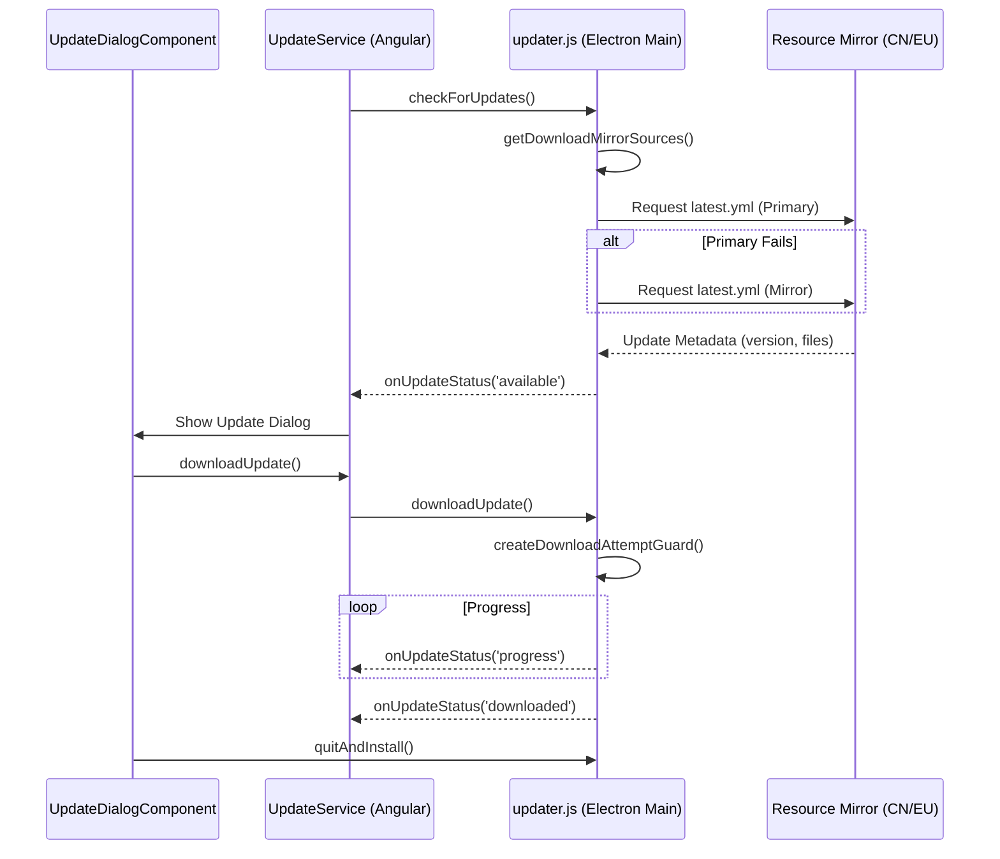

# Configuration and Update System

<details>
<summary>Relevant source files</summary>

The following files were used as context for generating this wiki page:

- [electron/config/config.json](electron/config/config.json)
- [electron/updater.js](electron/updater.js)
- [src/app/configs/esp32.config.ts](src/app/configs/esp32.config.ts)
- [src/app/main-window/components/update-dialog/update-dialog.component.html](src/app/main-window/components/update-dialog/update-dialog.component.html)
- [src/app/main-window/components/update-dialog/update-dialog.component.scss](src/app/main-window/components/update-dialog/update-dialog.component.scss)
- [src/app/main-window/components/update-dialog/update-dialog.component.ts](src/app/main-window/components/update-dialog/update-dialog.component.ts)
- [src/app/services/config.service.ts](src/app/services/config.service.ts)
- [src/app/services/update.service.ts](src/app/services/update.service.ts)
- [src/app/windows/settings/settings.component.html](src/app/windows/settings/settings.component.html)
- [src/app/windows/settings/settings.component.scss](src/app/windows/settings/settings.component.scss)
- [src/app/windows/settings/settings.component.ts](src/app/windows/settings/settings.component.ts)

</details>

The Configuration and Update System manages application-wide settings, regional flavors, hardware metadata distribution, and the automated software update pipeline. It ensures that the IDE can adapt to different network environments (particularly CN vs. Global) and maintain up-to-date resources for hardware development.

## ConfigService and Regional Flavors

The `ConfigService` is the central authority for application state and environmental settings. It implements a layered configuration model where a base configuration is merged with user-specific overrides.

### Configuration Layering

The system merges configurations in the following order:

1.  **Default Configuration**: Loaded from the application package at `config/config.json` [[src/app/services/config.service.ts:132-134]]().
2.  **User Configuration**: Loaded from the system AppData path (`config.json`) [[src/app/services/config.service.ts:139-148]]().
3.  **Environment Variables**: Overrides from the Electron main process via `AILY_REGION`, `AILY_OFFICIAL_REGION`, and `AILY_BUILD_FLAVOR` [[src/app/services/config.service.ts:153-162]]().

### Regional Logic (CN vs. Global)

Aily Blockly supports multiple \"flavors\" (primarily `cn` and `global`) to handle regional network constraints [[src/app/services/config.service.ts:14-15]](). The `ConfigService` dynamically updates API endpoints and registry URLs based on the active region.

**Regional Configuration Data Flow**

```mermaid
graph TD
    subgraph \"ConfigService Initialization\"
        LoadFiles[\"load()\"]
        EnvInvoke[\"IPC: env-get\"]
    end

    subgraph \"Code Entities\"
        ApplyConfig[\"applyRegionRuntimeConfig(regionKey)\"]
        SetAPI[\"setServerUrl()\"]
        SetNPM[\"setRegistryUrl()\"]
        SetTool[\"setToolWebUrl()\"]
    end

    subgraph \"Target Endpoints\"
        CN_API[\"api.yiyu.pro\"]
        EU_API[\"api.aily.pro\"]
        CN_NPM[\"registry.yiyu.pro\"]
        EU_NPM[\"registry.aily.pro\"]
    end

    LoadFiles --> EnvInvoke
    EnvInvoke --> ApplyConfig
    ApplyConfig --> SetAPI
    ApplyConfig --> SetNPM
    ApplyConfig --> SetTool

    SetAPI -.-> CN_API
    SetAPI -.-> EU_API
    SetNPM -.-> CN_NPM
    SetNPM -.-> EU_NPM
```

Sources: [src/app/services/config.service.ts:94-103](), [src/app/services/config.service.ts:153-175](), [electron/config.json:33-70]()

## Hardware Metadata Pipeline

The IDE maintains a local cache of hardware boards, libraries, and tags to ensure offline capability and fast startup.

| Function                              | Role                                                                                | Source                                         |
| :------------------------------------ | :---------------------------------------------------------------------------------- | :--------------------------------------------- |
| `loadAndCacheBoardList`               | Fetches `boards.json` from resource sources and caches locally.                     | [src/app/services/config.service.ts:196-197]() |
| `loadAndCacheLibraryList`             | Fetches `libraries.json` and updates the local dependency index.                    | [src/app/services/config.service.ts:187-187]() |
| `applyResourceSourceRuntimeSelection` | Selects the best resource mirror (e.g., `rs1.aily.pro`) based on latency or config. | [src/app/services/config.service.ts:177-177]() |

Sources: [src/app/services/config.service.ts:185-194](), [electron/config.json:14-25]()

## Settings UI

The `SettingsComponent` provides a multi-pane interface for user customization. It is organized into sections such as Basic, Theme, Blockly, Repository, and Dependencies [[src/app/windows/settings/settings.component.ts:55-92]]().

### Key Interactions

- **Region Switching**: Changing the region (e.g., from CN to EU) triggers a logout if the user is authenticated, as account data is region-locked [[src/app/windows/settings/settings.component.ts:187-227]]().
- **Resource Source**: Users can manually select mirrors or set it to `auto` for the system to decide [[src/app/windows/settings/settings.component.html:115-134]]().
- **Dependency Management**: Lists installed boards and tools, allowing for search and updates [[src/app/windows/settings/settings.component.html:139-151]]().

Sources: [src/app/windows/settings/settings.component.html:1-136](), [src/app/windows/settings/settings.component.ts:1-184]()

## Auto-Updater and Mirror-Switching

The application utilizes `electron-updater` with a custom mirror-switching logic implemented in `electron/updater.js`. This ensures that if a primary update server is unreachable (e.g., due to regional firewalls), the IDE can failover to a mirror.

### Update Logic Entities

- **UpdateService (Renderer)**: Manages the update UI lifecycle, including the `UpdateDialogComponent` [[src/app/services/update.service.ts:13-30]]().
- **updater.js (Main)**: Handles the heavy lifting of checking manifests and downloading binaries with fallback strategies [[electron/updater.js:1-12]]().

**Update & Mirror-Switching Pipeline**



Sources: [electron/updater.js:62-92](), [electron/updater.js:244-245](), [src/app/services/update.service.ts:38-80](), [src/app/main-window/components/update-dialog/update-dialog.component.ts:82-107]()

### Download Strategy

The `update_download_strategy` in `config.json` defines how the system behaves during failures:

- **mirror_region_order**: Defines the sequence of regions to try (e.g., `[\"eu\", \"cn\"]`) [[electron/config.json:28-28]]().
- **stall_timeout_ms**: Time to wait before considering a download stalled and switching mirrors [[electron/config.json:31-31]]().
- **fallback_on_error**: Boolean flag to enable/disable automatic mirror switching [[electron/updater.js:94-98]]().

Sources: [electron/updater.js:100-115](), [electron/config.json:26-32]()
