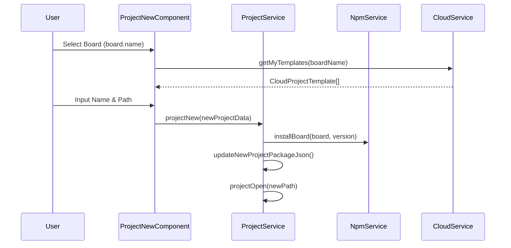

# Project Lifecycle

<details>
<summary>Relevant source files</summary>

The following files were used as context for generating this wiki page:

- [electron/tools.js](electron/tools.js)
- [public/brands/microbit.webp](public/brands/microbit.webp)
- [public/brands/nordic.webp](public/brands/nordic.webp)
- [src/app/configs/board.config.ts](src/app/configs/board.config.ts)
- [src/app/editors/blockly-editor/blockly-editor.component.ts](src/app/editors/blockly-editor/blockly-editor.component.ts)
- [src/app/editors/blockly-editor/services/project.service.ts](src/app/editors/blockly-editor/services/project.service.ts)
- [src/app/func/func.ts](src/app/func/func.ts)
- [src/app/pages/guide/guide.component.html](src/app/pages/guide/guide.component.html)
- [src/app/pages/guide/guide.component.scss](src/app/pages/guide/guide.component.scss)
- [src/app/pages/guide/guide.component.ts](src/app/pages/guide/guide.component.ts)
- [src/app/pages/playground/playground.component.html](src/app/pages/playground/playground.component.html)
- [src/app/pages/playground/playground.component.scss](src/app/pages/playground/playground.component.scss)
- [src/app/pages/playground/playground.component.ts](src/app/pages/playground/playground.component.ts)
- [src/app/pages/playground/subject-item/subject-item.component.html](src/app/pages/playground/subject-item/subject-item.component.html)
- [src/app/pages/playground/subject-item/subject-item.component.scss](src/app/pages/playground/subject-item/subject-item.component.scss)
- [src/app/pages/playground/subject-item/subject-item.component.ts](src/app/pages/playground/subject-item/subject-item.component.ts)
- [src/app/pages/playground/subject-list/subject-list.component.html](src/app/pages/playground/subject-list/subject-list.component.html)
- [src/app/pages/playground/subject-list/subject-list.component.scss](src/app/pages/playground/subject-list/subject-list.component.scss)
- [src/app/pages/playground/subject-list/subject-list.component.ts](src/app/pages/playground/subject-list/subject-list.component.ts)
- [src/app/pages/project-new/components/brand-list/brand-list.component.html](src/app/pages/project-new/components/brand-list/brand-list.component.html)
- [src/app/pages/project-new/components/brand-list/brand-list.component.scss](src/app/pages/project-new/components/brand-list/brand-list.component.scss)
- [src/app/pages/project-new/components/brand-list/brand-list.component.ts](src/app/pages/project-new/components/brand-list/brand-list.component.ts)
- [src/app/pages/project-new/project-new.component.html](src/app/pages/project-new/project-new.component.html)
- [src/app/pages/project-new/project-new.component.scss](src/app/pages/project-new/project-new.component.scss)
- [src/app/pages/project-new/project-new.component.ts](src/app/pages/project-new/project-new.component.ts)
- [src/app/services/project.service.ts](src/app/services/project.service.ts)
- [src/app/windows/project-new/project-new.component.html](src/app/windows/project-new/project-new.component.html)
- [src/app/windows/project-new/project-new.component.scss](src/app/windows/project-new/project-new.component.scss)
- [src/app/windows/project-new/project-new.component.ts](src/app/windows/project-new/project-new.component.ts)

</details>

This document describes the complete lifecycle of Aily Blockly projects, including creation via wizards or templates, loading with resource locking, management of the `.temp` synchronization, and persistence using the `project.abi` format.

## Project Structure and Configuration

Every Aily Blockly project is a directory containing metadata and workspace state. The `ProjectService` manages the `ProjectPackageData` which tracks the board type, framework, and cloud association.

```mermaid
graph TB
    subgraph \"ProjectDirectory [File System]\"
        PKG[\"package.json [Project Metadata]\"]
        ABI[\"project.abi [Blockly Workspace JSON]\"]
        TEMP[\"project.abi.temp [Dirty State Sync]\"]
        MODULES[\"node_modules/ [Local Dependencies]\"]
    end

    subgraph \"CodeEntities [ProjectService]\"
        DATA[\"currentPackageData: ProjectPackageData\"]
        PATH[\"currentProjectPath: string\"]
        STATE[\"stateSubject: BehaviorSubject\"]
    end

    PKG -.-> DATA
    ABI -.-> DATA
    PATH --> PKG
```

The project metadata includes the board identifier and the development framework (e.g., Arduino, MicroPython).
Sources: [src/app/services/project.service.ts:24-36](), [src/app/services/project.service.ts:71-73]()

## Project Creation Flow

The creation process is handled by the `ProjectNewComponent` (either as a standalone page or a sub-window). It utilizes a wizard to select hardware boards and optionally retrieve cloud templates.

### 1. Wizard and Board Selection

Users search for boards using a fuzzy search index created via `createBoardSearchIndex`. The `ProjectService.generateUniqueProjectName` ensures no directory conflicts.

### 2. Template Retrieval

If a template is selected, the system fetches it from the cloud via `CloudService.getMyTemplates`.

### 3. Implementation Flow



Sources: [src/app/windows/project-new/project-new.component.ts:139-168](), [src/app/pages/project-new/project-new.component.ts:213-238](), [src/app/services/project.service.ts:251-300](), [src/app/utils/fuzzy-search.utils.ts:1-20]()

## Project Opening and Locking

When a project is opened, the system checks for file associations and manages resource locks to prevent concurrent modifications.

- **File Association**: `ProjectService` listens for `open-project-from-file` IPC events.
- **Project Locking**: The `AppDataResourceLockService` is used during critical operations like example installation to ensure exclusive access to the `node_modules` in the app data path.
- **Board Migration**: If a project is opened and the board package is missing, `BlocklyEditorComponent` triggers a dependency watch and attempts to reload the board configuration.

Sources: [src/app/services/project.service.ts:134-143](), [src/app/pages/playground/subject-item/subject-item.component.ts:100-103](), [src/app/editors/blockly-editor/blockly-editor.component.ts:61-80]()

## Persistence and Synchronization

Aily Blockly uses a dual-file approach for workspace persistence to prevent data loss.

### project.abi and .temp Sync

- **project.abi**: The primary JSON serialization of the Blockly workspace.
- **codeHash Tracking**: The system tracks the hash of the generated code to determine if the hardware needs a re-upload.
- **Dirty State**: `ProjectService` tracks changes. While the editor is active, temporary states are synchronized to ensure that unexpected crashes do not result in total work loss.

### Saving Logic

The `projectSave` method in `ProjectService` (aliased in some contexts as `_ProjectService`) handles the writing of the workspace to the filesystem.

```mermaid
graph TD
    subgraph \"WorkspacePersistence [ProjectService.projectSave]\"
        WS[\"Blockly Workspace State\"]
        GEN[\"Generated C++/Python Code\"]
        HASH[\"Compute codeHash\"]
    end

    subgraph \"FileSystem [fs.writeFileSync]\"
        ABI_FILE[\"project.abi [JSON]\"]
        TEMP_FILE[\"project.abi.temp\"]
    end

    WS --> ABI_FILE
    GEN --> ABI_FILE
    HASH --> ABI_FILE
    WS -- \"Auto-Sync\" --> TEMP_FILE
```

Sources: [src/app/services/project.service.ts:59-60](), [src/app/editors/blockly-editor/services/project.service.ts:100-120](), [src/app/editors/blockly-editor/blockly-editor.component.ts:167-180]()

## Board Migration and Updates

When a project's board configuration changes (e.g., updating a board version in `package.json`), the `BlocklyEditorComponent` detects this via a file watcher.

1.  **Detection**: `packageJsonWatcherDispose` monitors the project directory.
2.  **Comparison**: The system compares `watchedBoardDependencies` with the new `package.json` content.
3.  **Reload**: If changes are detected, `pendingBoardReloadTimer` is triggered to re-initialize the workspace with the new board's block definitions and generators.

Sources: [src/app/editors/blockly-editor/blockly-editor.component.ts:61-80](), [src/app/editors/blockly-editor/blockly-editor.component.ts:167-175]()

## Lifecycle States

The `ProjectService` maintains a `stateSubject` to broadcast the current status of the project to the rest of the application.

| State     | Description                                              |
| :-------- | :------------------------------------------------------- |
| `default` | No project is currently active.                          |
| `loading` | The system is reading files and installing dependencies. |
| `loaded`  | The project is ready for editing and building.           |
| `saving`  | The `project.abi` file is being written to disk.         |
| `saved`   | The persistence operation completed successfully.        |
| `error`   | An error occurred during loading or saving.              |

Sources: [src/app/services/project.service.ts:59-60]()
