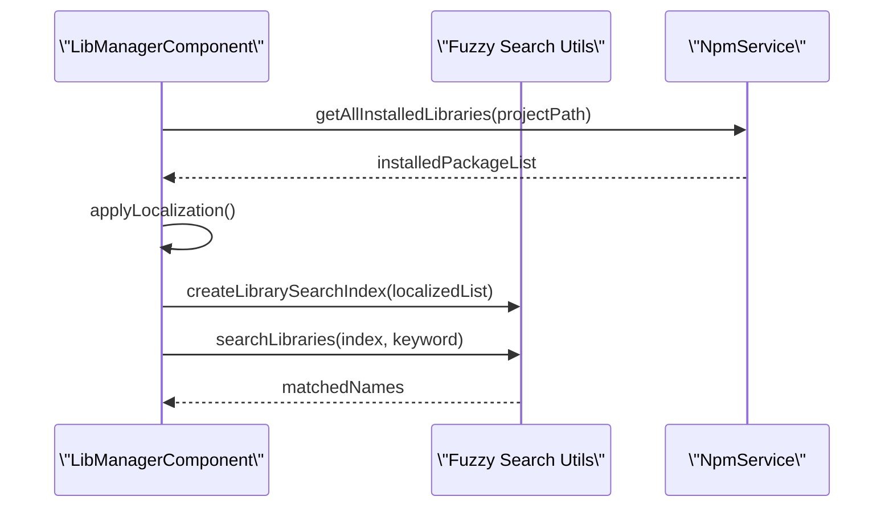
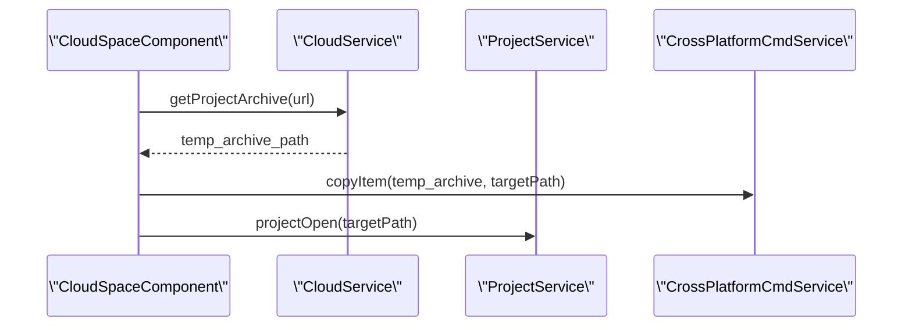

# Library Management

<details>
<summary>Relevant source files</summary>

The following files were used as context for generating this wiki page:

- [electron/appdata-resource-lock.js](electron/appdata-resource-lock.js)
- [electron/cmd.js](electron/cmd.js)
- [electron/npm.js](electron/npm.js)
- [public/brands/sensecraft-light.webp](public/brands/sensecraft-light.webp)
- [public/brands/sensecraft.webp](public/brands/sensecraft.webp)
- [src/app/editors/blockly-editor/components/compatible-dialog/compatible-dialog.component.scss](src/app/editors/blockly-editor/components/compatible-dialog/compatible-dialog.component.scss)
- [src/app/editors/blockly-editor/components/lib-manager/lib-manager.component.html](src/app/editors/blockly-editor/components/lib-manager/lib-manager.component.html)
- [src/app/editors/blockly-editor/components/lib-manager/lib-manager.component.scss](src/app/editors/blockly-editor/components/lib-manager/lib-manager.component.scss)
- [src/app/editors/blockly-editor/components/lib-manager/lib-manager.component.ts](src/app/editors/blockly-editor/components/lib-manager/lib-manager.component.ts)
- [src/app/interceptors/auth.interceptor.ts](src/app/interceptors/auth.interceptor.ts)
- [src/app/pages/playground/example-list/example-list.component.html](src/app/pages/playground/example-list/example-list.component.html)
- [src/app/pages/playground/example-list/example-list.component.scss](src/app/pages/playground/example-list/example-list.component.scss)
- [src/app/pages/playground/example-list/example-list.component.ts](src/app/pages/playground/example-list/example-list.component.ts)
- [src/app/services/appdata-resource-lock.service.ts](src/app/services/appdata-resource-lock.service.ts)
- [src/app/services/cmd.service.ts](src/app/services/cmd.service.ts)
- [src/app/services/log.service.ts](src/app/services/log.service.ts)
- [src/app/services/npm.service.ts](src/app/services/npm.service.ts)
- [src/app/services/settings.service.ts](src/app/services/settings.service.ts)
- [src/app/tools/aily-chat/tools/buildProjectTool.ts](src/app/tools/aily-chat/tools/buildProjectTool.ts)
- [src/app/tools/aily-chat/tools/getErrorsTool.ts](src/app/tools/aily-chat/tools/getErrorsTool.ts)
- [src/app/tools/aily-chat/tools/memoryTool.ts](src/app/tools/aily-chat/tools/memoryTool.ts)
- [src/app/tools/aily-chat/tools/registered/project-tools.ts](src/app/tools/aily-chat/tools/registered/project-tools.ts)
- [src/app/tools/aily-chat/tools/replaceStringTool.ts](src/app/tools/aily-chat/tools/replaceStringTool.ts)
- [src/app/tools/aily-chat/tools/runSubagentTool.ts](src/app/tools/aily-chat/tools/runSubagentTool.ts)
- [src/app/tools/cloud-space/cloud-space.component.ts](src/app/tools/cloud-space/cloud-space.component.ts)
- [src/app/tools/cloud-space/editor/editor.component.html](src/app/tools/cloud-space/editor/editor.component.html)
- [src/app/tools/cloud-space/editor/editor.component.scss](src/app/tools/cloud-space/editor/editor.component.scss)
- [src/app/tools/cloud-space/editor/editor.component.ts](src/app/tools/cloud-space/editor/editor.component.ts)
- [src/app/tools/cloud-space/services/cloud.service.ts](src/app/tools/cloud-space/services/cloud.service.ts)
- [src/app/utils/blockly_updater.ts](src/app/utils/blockly_updater.ts)
- [src/app/utils/img.utils.ts](src/app/utils/img.utils.ts)

</details>

## Purpose and Scope

The Library Management system provides discovery, installation, and management of code libraries for Aily Blockly projects. It handles NPM-based library operations, compatibility checking with hardware boards, and automatic integration with the visual programming environment. Libraries are typically packaged as NPM modules with the `@aily-project/lib-` prefix and contain block definitions, code generators, and hardware-specific functionality. The system also includes a Cloud Space for community-driven library and project sharing.

## System Architecture

The library management system bridges the Angular frontend with the Electron main process to perform file system and CLI operations.

```mermaid
graph TB
    subgraph \"UI Layer (Angular)\"
        LMC[\"LibManagerComponent\"]
        CSC[\"CloudSpaceComponent\"]
        LCD[\"CompatibleDialogComponent\"]
    end

    subgraph \"Service Layer\"
        NS[\"NpmService\"]
        CS[\"CmdService\"]
        CLDS[\"CloudService\"]
        PS[\"ProjectService\"]
        BS[\"BlocklyService\"]
    end

    subgraph \"Electron Main Process\"
        ECMD[\"electron/cmd.js\"]
        ENPM[\"electron/npm.js\"]
        FS[\"fs / path modules\"]
    end

    subgraph \"External & Project Storage\"
        NPM_REG[\"NPM Registry / Verdaccio\"]
        CLOUD_API[\"Cloud API (API.cloudSync)\"]
        PROJ_NM[\"project/node_modules/\"]
        PROJ_PKG[\"project/package.json\"]
    end

    LMC --> NS
    CSC --> CLDS
    NS --> CS
    CLDS --> PS
    CS --> ECMD
    NS --> ENPM
    ENPM --> NPM_REG
    ECMD --> FS
    PS --> PROJ_PKG
    BS --> PROJ_NM
```

Sources: [src/app/editors/blockly-editor/components/lib-manager/lib-manager.component.ts:45-76](), [src/app/services/npm.service.ts:19-36](), [src/app/services/cmd.service.ts:39-46](), [electron/cmd.js:146-150]()

## Library Discovery and Search

Discovery is handled through the `LibManagerComponent`, which processes both pre-configured libraries and those already installed in the local project.

| Feature                | Implementation                                                         | Location                                                                                   |
| ---------------------- | ---------------------------------------------------------------------- | ------------------------------------------------------------------------------------------ |
| **Fuzzy Search**       | Uses Orama engine via `createLibrarySearchIndex` and `searchLibraries` | [src/app/editors/blockly-editor/components/lib-manager/lib-manager.component.ts:159-190]() |
| **Local Search**       | Filters by `installed` or `lib-core` tags for local management         | [src/app/editors/blockly-editor/components/lib-manager/lib-manager.component.ts:170-177]() |
| **Installation Check** | Scans `node_modules` via `npmService.getAllInstalledLibraries`         | [src/app/editors/blockly-editor/components/lib-manager/lib-manager.component.ts:98-138]()  |
| **Registry Sync**      | Fetches version lists from Verdaccio registries                        | [src/app/services/settings.service.ts:27-64]()                                             |

### Search Logic Flow



Sources: [src/app/editors/blockly-editor/components/lib-manager/lib-manager.component.ts:105-110](), [src/app/editors/blockly-editor/components/lib-manager/lib-manager.component.ts:181-182]()

## Library Installation and Lifecycle

Library operations are performed using NPM commands executed through a specialized bridge.

### Installation Workflow

1.  **Compatibility Check**: Before installation, the system compares `lib.compatibility.core` with the current project's board core [src/app/editors/blockly-editor/components/lib-manager/lib-manager.component.ts:340-353]().
2.  **NPM Execution**: The `NpmService` triggers `npm install` via `CmdService` [src/app/editors/blockly-editor/components/lib-manager/lib-manager.component.ts:316-320]().
3.  **Progress Tracking**: `NpmService` parses logs for \"Download progress\" or \"Extract progress\" to update the UI notice [src/app/services/npm.service.ts:73-94]().
4.  **Blockly Sync**: Upon completion, `BlocklyService` loads the new library's blocks and generators into the workspace.

### Dependency Resolution (Board-Level)

When a board is installed or changed, `NpmService` handles `installBoardDependencies`, which recursively resolves and installs required tools, SDKs, and compilers defined in the board's `package.json` [src/app/services/npm.service.ts:133-140]().

Sources: [src/app/services/npm.service.ts:107-118](), [src/app/editors/blockly-editor/components/lib-manager/lib-manager.component.ts:365-385]()

## Cloud Space and Community Libraries

The Cloud Space provides a repository for community projects and libraries, managed by `CloudService`.

| Component                | Function                                                               | File                                                                      |
| ------------------------ | ---------------------------------------------------------------------- | ------------------------------------------------------------------------- |
| **CloudSpaceComponent**  | UI for browsing, searching, and opening cloud projects                 | [src/app/tools/cloud-space/cloud-space.component.ts:34-58]()              |
| **CloudService**         | Handles API requests for syncing, publishing, and downloading archives | [src/app/tools/cloud-space/services/cloud.service.ts:24-35]()             |
| **ExampleListComponent** | Displays curated public examples for specific hardware boards          | [src/app/pages/playground/example-list/example-list.component.ts:41-76]() |

### Cloud Project Retrieval



Sources: [src/app/tools/cloud-space/cloud-space.component.ts:116-157](), [src/app/tools/cloud-space/services/cloud.service.ts:251-260]()

## Command Execution and NPM Integration

The `CmdService` and the Electron `cmd.js` module form the backbone of library management, ensuring commands are executed correctly across Windows, macOS, and Linux.

### Key Implementation Details

- **Shell Selection**: On Windows, it uses `powershell.exe` for general commands but switches to `cmd.exe` for `.cmd` or `.bat` files to avoid execution policy issues [electron/cmd.js:158-186]().
- **NPM Optimization**: Automatically adds `--foreground-scripts` to `npm install` to ensure `postinstall` output (like progress logs) is captured [electron/cmd.js:189-197]().
- **Process Cleanup**: `killRegisteredProcessTree` uses `taskkill /T /F` on Windows and `SIGTERM` on Unix to ensure no orphan processes remain when an installation is cancelled [electron/cmd.js:24-69]().
- **Output Throttling**: Progress logs are merged using a `mergeKey` (e.g., `download-progress`) to prevent UI flickering during high-frequency log updates [src/app/services/log.service.ts:31-41]().

Sources: [electron/cmd.js:153-220](), [src/app/services/cmd.service.ts:53-110](), [electron/npm.js:181-227]()

## AI-Assisted Library Management

The AI Agent can perform library operations through the `execute_command` tool.

- **Safety Checks**: Before running `npm uninstall`, the agent checks if any blocks from that library are currently in use in the Blockly workspace [src/app/tools/aily-chat/tools/registered/project-tools.ts:85-118]().
- **Automatic Loading**: After an `npm install` command succeeds, the agent can trigger `host.blockly.loadLibrary` to make the new blocks immediately available [src/app/tools/aily-chat/tools/registered/project-tools.ts:156-166]().

Sources: [src/app/tools/aily-chat/tools/registered/project-tools.ts:71-152]()
