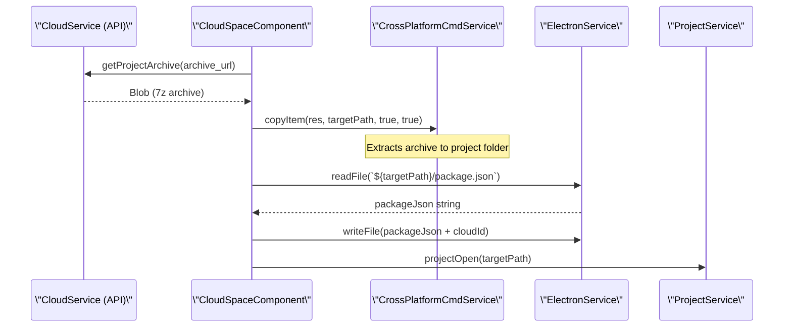

# Library Editor

<details>
<summary>Relevant source files</summary>

The following files were used as context for generating this wiki page:

- [public/brands/sensecraft-light.webp](public/brands/sensecraft-light.webp)
- [public/brands/sensecraft.webp](public/brands/sensecraft.webp)
- [src/app/editors/blockly-editor/components/compatible-dialog/compatible-dialog.component.scss](src/app/editors/blockly-editor/components/compatible-dialog/compatible-dialog.component.scss)
- [src/app/editors/blockly-editor/components/lib-manager/lib-manager.component.html](src/app/editors/blockly-editor/components/lib-manager/lib-manager.component.html)
- [src/app/editors/blockly-editor/components/lib-manager/lib-manager.component.scss](src/app/editors/blockly-editor/components/lib-manager/lib-manager.component.scss)
- [src/app/editors/blockly-editor/components/lib-manager/lib-manager.component.ts](src/app/editors/blockly-editor/components/lib-manager/lib-manager.component.ts)
- [src/app/interceptors/auth.interceptor.ts](src/app/interceptors/auth.interceptor.ts)
- [src/app/pages/playground/example-list/example-list.component.html](src/app/pages/playground/example-list/example-list.component.html)
- [src/app/pages/playground/example-list/example-list.component.scss](src/app/pages/playground/example-list/example-list.component.scss)
- [src/app/pages/playground/example-list/example-list.component.ts](src/app/pages/playground/example-list/example-list.component.ts)
- [src/app/tools/aily-chat/tools/buildProjectTool.ts](src/app/tools/aily-chat/tools/buildProjectTool.ts)
- [src/app/tools/aily-chat/tools/getErrorsTool.ts](src/app/tools/aily-chat/tools/getErrorsTool.ts)
- [src/app/tools/aily-chat/tools/memoryTool.ts](src/app/tools/aily-chat/tools/memoryTool.ts)
- [src/app/tools/aily-chat/tools/registered/project-tools.ts](src/app/tools/aily-chat/tools/registered/project-tools.ts)
- [src/app/tools/aily-chat/tools/replaceStringTool.ts](src/app/tools/aily-chat/tools/replaceStringTool.ts)
- [src/app/tools/aily-chat/tools/runSubagentTool.ts](src/app/tools/aily-chat/tools/runSubagentTool.ts)
- [src/app/tools/cloud-space/cloud-space.component.ts](src/app/tools/cloud-space/cloud-space.component.ts)
- [src/app/tools/cloud-space/editor/editor.component.html](src/app/tools/cloud-space/editor/editor.component.html)
- [src/app/tools/cloud-space/editor/editor.component.scss](src/app/tools/cloud-space/editor/editor.component.scss)
- [src/app/tools/cloud-space/editor/editor.component.ts](src/app/tools/cloud-space/editor/editor.component.ts)
- [src/app/tools/cloud-space/services/cloud.service.ts](src/app/tools/cloud-space/services/cloud.service.ts)
- [src/app/utils/blockly_updater.ts](src/app/utils/blockly_updater.ts)
- [src/app/utils/img.utils.ts](src/app/utils/img.utils.ts)

</details>

The Library Editor provides a comprehensive interface for viewing and modifying Blockly library definitions and project assets within the Aily IDE. This system includes the **Cloud Space** for community and personal project management, the **Library Manager** for dependency control, and utility services for block data integrity.

## Cloud Space Editor

The Cloud Space is a centralized hub for managing personal and public projects. It allows users to synchronize local projects to the cloud, download community examples, and edit project metadata.

### Cloud Project Management

The `CloudSpaceComponent` manages the interaction between the local file system and the remote repository. It handles project discovery, filtering, and the transition of cloud projects into local workspaces.

- **Project Retrieval**: Fetches paginated project lists using `CloudService.getProjects()` [src/app/tools/cloud-space/cloud-space.component.ts:160-191]().
- **Local Import**: Downloads project archives (.7z) and extracts them into the local project root. It uses `crossPlatformCmdService.copyItem` to move files and updates `package.json` with cloud identifiers [src/app/tools/cloud-space/cloud-space.component.ts:116-157]().

### Metadata Editor

The `EditorComponent` (within Cloud Space) provides a dedicated UI for modifying project properties before or after synchronization.

| Field           | Implementation Detail                                                                                                                                                        |
| --------------- | ---------------------------------------------------------------------------------------------------------------------------------------------------------------------------- |
| **Nickname**    | Primary display name, validated as required [src/app/tools/cloud-space/editor/editor.component.ts:170-173]().                                                                |
| **Tags**        | Managed as a string array, displayed using `nz-tag` with dynamic colors [src/app/tools/cloud-space/editor/editor.component.ts:63-85]().                                      |
| **Cover Image** | Supports local file selection with automatic **WebP conversion** and resizing to 500x250 via `resizeImage` [src/app/tools/cloud-space/editor/editor.component.ts:184-219](). |

Sources: [src/app/tools/cloud-space/cloud-space.component.ts:34-94](), [src/app/tools/cloud-space/editor/editor.component.ts:1-50](), [src/app/tools/cloud-space/services/cloud.service.ts:148-166]()

## Library Manager

The Library Manager (`LibManagerComponent`) is the primary interface for managing block libraries installed via NPM. It handles the discovery of both core and community-contributed blocks.

### Search and Indexing

The system uses a high-performance fuzzy search engine to locate libraries.

- **Orama Index**: Libraries are indexed using the Orama search engine via `createLibrarySearchIndex` [src/app/editors/blockly-editor/components/lib-manager/lib-manager.component.ts:179-182]().
- **Localization**: Search results are localized on-the-fly using `applyLocalization` before being presented to the user [src/app/editors/blockly-editor/components/lib-manager/lib-manager.component.ts:188-190]().

### Installation Pipeline

The manager coordinates with `NpmService` and `CmdService` to modify project dependencies:

1. **Status Check**: Determines if a library is `installed`, `installing`, or `default` by scanning `node_modules` [src/app/editors/blockly-editor/components/lib-manager/lib-manager.component.ts:98-138]().
2. **Installation**: Triggers `npm install` via the command service.
3. **Integrity**: Validates if the library is \"tested\" and displays warning icons for unverified libraries [src/app/editors/blockly-editor/components/lib-manager/lib-manager.component.html:44-49]().

Sources: [src/app/editors/blockly-editor/components/lib-manager/lib-manager.component.ts:45-96](), [src/app/editors/blockly-editor/components/lib-manager/lib-manager.component.html:1-40]()

## Blockly Data Utilities

To maintain compatibility between different versions of libraries and project files, the editor employs several utility layers.

### Block Updater

The `updateBlocksInFile` utility is used when loading examples or opening older projects. It ensures that the block definitions in the project's `.abi` or `.temp` files match the currently installed library versions [src/app/pages/playground/example-list/example-list.component.ts:22]().

### AI-Driven Library Operations

The AI Agent can interact with the library system through `ExecuteCommandTool`. It performs safety checks before uninstallation:

- **Usage Detection**: Scans the project's ABI JSON to see if any block types from the library being uninstalled are currently in use [src/app/tools/aily-chat/tools/registered/project-tools.ts:95-112]().
- **Rollback Logic**: If an `npm uninstall` fails, the agent attempts to reload the library into the Blockly workspace to prevent UI inconsistency [src/app/tools/aily-chat/tools/registered/project-tools.ts:136-146]().

Sources: [src/app/tools/aily-chat/tools/registered/project-tools.ts:67-153](), [src/app/pages/playground/example-list/example-list.component.ts:78-105]()

## Implementation Diagrams

### Cloud Project Data Flow

This diagram illustrates the transition from a remote \"Cloud Entity\" to a local \"Project Entity\".



Sources: [src/app/tools/cloud-space/cloud-space.component.ts:116-157](), [src/app/tools/cloud-space/services/cloud.service.ts:251-255]()

### Library Search and Load Architecture

This diagram maps the natural language search intent to code-level indexing and service calls.

```mermaid
flowchart TD
    User[\"User Input (keyword)\"] --> Search[\"LibManagerComponent.search()\"]
    Search --> Subject[\"searchSubject.next()\"]
    Subject -->|debounceTime| DoSearch[\"doSearch()\"]

    subgraph \"Indexing Logic\"
        DoSearch --> Index[\"createLibrarySearchIndex(localizedList)\"]
        Index --> Orama[\"searchLibraries(searchIndex, keyword)\"]
    end

    Orama --> Results[\"Filtered libraryList\"]
    Results --> UI[\"lib-manager.component.html (Async Pipe)\"]

    subgraph \"Action Services\"
        UI -->|\"installLib()\"| Npm[\"NpmService.install()\"]
        UI -->|\"removeLib()\"| NpmR[\"NpmService.uninstall()\"]
    end
```

Sources: [src/app/editors/blockly-editor/components/lib-manager/lib-manager.component.ts:154-190](), [src/app/editors/blockly-editor/components/lib-manager/lib-manager.component.html:42-121]()

## Technical Reference

### Cloud Service API Endpoints

| Function            | Endpoint                               | Method                                                              |
| ------------------- | -------------------------------------- | ------------------------------------------------------------------- |
| `getProjects`       | `API.cloudProjects`                    | GET [src/app/tools/cloud-space/services/cloud.service.ts:97-107]()  |
| `syncProject`       | `API.cloudSync`                        | POST [src/app/tools/cloud-space/services/cloud.service.ts:52-90]()  |
| `updateProject`     | `${API.cloudProjectsUrl}/${projectId}` | PUT [src/app/tools/cloud-space/services/cloud.service.ts:114-142]() |
| `getPublicProjects` | `API.cloudPublicProjects`              | GET [src/app/tools/cloud-space/services/cloud.service.ts:40-45]()   |

### Project Example Parameters

When loading examples from the cloud, parameters are encoded in Base64 and sanitized using `jsonrepair` to handle potential control character corruption during transmission [src/app/pages/playground/example-list/example-list.component.ts:78-105]().

Sources: [src/app/tools/cloud-space/services/cloud.service.ts:24-29](), [src/app/pages/playground/example-list/example-list.component.ts:89-94]()
