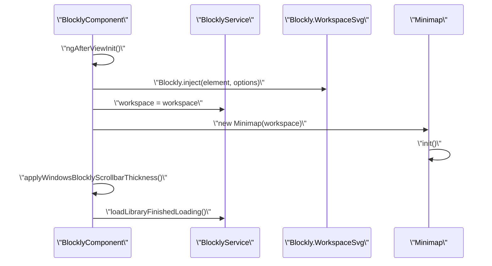

# Blockly Integration

<details>
<summary>Relevant source files</summary>

The following files were used as context for generating this wiki page:

- [src/app/components/aily-blockly/aily-blockly.component.html](src/app/components/aily-blockly/aily-blockly.component.html)
- [src/app/components/aily-blockly/aily-blockly.component.scss](src/app/components/aily-blockly/aily-blockly.component.scss)
- [src/app/components/aily-blockly/aily-blockly.component.ts](src/app/components/aily-blockly/aily-blockly.component.ts)
- [src/app/editors/blockly-editor/blockly-editor.component.html](src/app/editors/blockly-editor/blockly-editor.component.html)
- [src/app/editors/blockly-editor/blockly-editor.component.scss](src/app/editors/blockly-editor/blockly-editor.component.scss)
- [src/app/editors/blockly-editor/components/blockly/blockly.component.html](src/app/editors/blockly-editor/components/blockly/blockly.component.html)
- [src/app/editors/blockly-editor/components/blockly/blockly.component.scss](src/app/editors/blockly-editor/components/blockly/blockly.component.scss)
- [src/app/editors/blockly-editor/components/blockly/blockly.component.ts](src/app/editors/blockly-editor/components/blockly/blockly.component.ts)
- [src/app/editors/blockly-editor/components/blockly/components/blockly-toolbox-pane/blockly-toolbox-pane.component.html](src/app/editors/blockly-editor/components/blockly/components/blockly-toolbox-pane/blockly-toolbox-pane.component.html)
- [src/app/editors/blockly-editor/components/blockly/components/blockly-toolbox-pane/blockly-toolbox-pane.component.scss](src/app/editors/blockly-editor/components/blockly/components/blockly-toolbox-pane/blockly-toolbox-pane.component.scss)
- [src/app/editors/blockly-editor/components/blockly/components/blockly-toolbox-pane/blockly-toolbox-pane.component.ts](src/app/editors/blockly-editor/components/blockly/components/blockly-toolbox-pane/blockly-toolbox-pane.component.ts)
- [src/app/editors/blockly-editor/components/blockly/components/blockly-workspace-pages/blockly-workspace-pages.component.html](src/app/editors/blockly-editor/components/blockly/components/blockly-workspace-pages/blockly-workspace-pages.component.html)
- [src/app/editors/blockly-editor/components/blockly/components/blockly-workspace-pages/blockly-workspace-pages.component.scss](src/app/editors/blockly-editor/components/blockly/components/blockly-workspace-pages/blockly-workspace-pages.component.scss)
- [src/app/editors/blockly-editor/components/blockly/components/blockly-workspace-pages/blockly-workspace-pages.component.ts](src/app/editors/blockly-editor/components/blockly/components/blockly-workspace-pages/blockly-workspace-pages.component.ts)
- [src/app/editors/blockly-editor/components/blockly/theme.config.ts](src/app/editors/blockly-editor/components/blockly/theme.config.ts)
- [src/app/editors/blockly-editor/components/dev-tool/dev-tool.component.html](src/app/editors/blockly-editor/components/dev-tool/dev-tool.component.html)
- [src/app/editors/blockly-editor/components/dev-tool/dev-tool.component.scss](src/app/editors/blockly-editor/components/dev-tool/dev-tool.component.scss)
- [src/app/editors/blockly-editor/components/dev-tool/dev-tool.component.ts](src/app/editors/blockly-editor/components/dev-tool/dev-tool.component.ts)
- [src/app/editors/blockly-editor/services/blockly.service.ts](src/app/editors/blockly-editor/services/blockly.service.ts)
- [src/app/editors/blockly-editor/utils/apply-windows-blockly-scrollbar-thickness.ts](src/app/editors/blockly-editor/utils/apply-windows-blockly-scrollbar-thickness.ts)
- [src/styles/themes/\_dark.scss](src/styles/themes/_dark.scss)
- [src/styles/themes/\_light.scss](src/styles/themes/_light.scss)

</details>

This document describes how Google Blockly is integrated into the Aily Blockly IDE to provide visual programming capabilities for hardware development. It covers the workspace initialization, multi-page management, library loading system, and the dynamic toolbox architecture.

## Core Integration Architecture

The Blockly integration is built around two primary components: `BlocklyComponent` which manages the visual workspace UI, and `BlocklyService` which handles the state of pages, library loading, and cross-component coordination.

### System Architecture

```mermaid
graph TB
    subgraph \"Angular Workspace\"
        BC[\"BlocklyComponent\"]
        BTP[\"BlocklyToolboxPaneComponent\"]
        BWP[\"BlocklyWorkspacePagesComponent\"]
        BE[\"BlocklyEditorComponent\"]
    end

    subgraph \"State Management\"
        BS[\"BlocklyService\"]
        PD[\"BlocklyProjectDocument\"]
        SM[\"BlocklySharedModel\"]
    end

    subgraph \"Blockly Core\"
        WS[\"Blockly.WorkspaceSvg\"]
        MM[\"Minimap Plugin\"]
        MS[\"Multiselect Plugin\"]
    end

    subgraph \"External Integration\"
        AG[\"arduinoGenerator\"]
        MG[\"micropythonGenerator\"]
        ABF[\"abf.ts (Asset Loader)\"]
    end

    BE --> BC
    BC --> BTP
    BC --> BWP
    BC --> BS

    BS --> PD
    PD --> SM

    BC --> WS
    WS --> MM
    WS --> MS

    BS --> ABF
    WS --> AG
    WS --> MG
```

Sources: [src/app/editors/blockly-editor/components/blockly/blockly.component.ts:1-100](), [src/app/editors/blockly-editor/services/blockly.service.ts:106-180](), [src/app/editors/blockly-editor/blockly-editor.component.html:1-18]()

## Workspace Management

The Aily IDE supports multi-page documents where each page represents a distinct Blockly workspace, while sharing a common data model (e.g., variables and procedures).

### Multi-Page and Shared Model

The `BlocklyProjectDocument` structure manages the state of all pages and the shared model.

| Entity               | Interface                | Description                                                               |
| :------------------- | :----------------------- | :------------------------------------------------------------------------ |
| **Project Document** | `BlocklyProjectDocument` | Contains `pages`, `activePageId`, and the `sharedModel`.                  |
| **Page Snapshot**    | `BlocklyPageSnapshot`    | Stores page `content` (JSON/XML), `title`, and `viewState` (zoom/scroll). |
| **Shared Model**     | `BlocklySharedModel`     | Stores `variables` and `procedureBlocks` shared across all pages.         |

Sources: [src/app/editors/blockly-editor/services/blockly.service.ts:19-43]()

### Workspace Initialization Sequence



Sources: [src/app/editors/blockly-editor/components/blockly/blockly.component.ts:144-300](), [src/app/editors/blockly-editor/utils/apply-windows-blockly-scrollbar-thickness.ts:1-10]()

## Library Loading Pipeline

The system supports loading block definitions and generators from local and remote sources with integrity checks.

### Loading Pipeline Flow

```mermaid
graph LR
    subgraph \"Discovery\"
        LM[\"Library Manager\"]
        UL[\"UsedLibraryManifest\"]
    end

    subgraph \"Validation\"
        IC[\"Integrity Check\"]
        VC[\"Version Check\"]
    end

    subgraph \"Registration\"
        ABF[\"abf.ts (Processors)\"]
        BD[\"Blockly.defineBlocksWithJsonArray\"]
        AG[\"arduinoGenerator\"]
    end

    LM --> UL
    UL --> IC
    IC --> VC
    VC --> ABF
    ABF --> BD
    ABF --> AG
```

The `abf.ts` utility functions are critical for transforming raw library data:

- `processI18n`: Injects translations into block definitions.
- `processJsonVar`: Replaces board-specific placeholders (e.g., pin numbers) in JSON.
- `processStaticFilePath`: Resolves relative asset paths to absolute system paths.

Sources: [src/app/editors/blockly-editor/services/blockly.service.ts:62-82](), [src/app/editors/blockly-editor/components/blockly/abf.ts:4-4]()

## Toolbox Pane and Dynamic Theming

The toolbox is implemented as a custom Angular component (`BlocklyToolboxPaneComponent`) rather than the default Blockly overlay, allowing for better integration with the IDE's layout.

### Toolbox Pane Implementation

The `BlocklyToolboxPaneComponent` provides:

- **Search**: Integrated search via `BlockSearcher`.
- **Category Management**: Tree-based navigation of block categories.
- **Drag-and-Drop Reordering**: Uses `SortableJS` to allow users to reorder categories.
- **Context Menus**: Right-click actions to open library folders or remove libraries.

Sources: [src/app/editors/blockly-editor/components/blockly/components/blockly-toolbox-pane/blockly-toolbox-pane.component.ts:35-103](), [src/app/editors/blockly-editor/components/blockly/components/blockly-toolbox-pane/blockly-toolbox-pane.component.html:1-55]()

### Dynamic Theming

The workspace styling is controlled via CSS variables and custom Blockly themes (`DarkTheme`, `LightTheme`).

```mermaid
graph TD
    subgraph \"Theme Engine\"
        TS[\"ThemeService\"]
        TC[\"theme.config.ts\"]
    end

    subgraph \"Style Definitions\"
        DS[\"_dark.scss\"]
        LS[\"_light.scss\"]
    end

    subgraph \"Blockly Application\"
        WS[\"Workspace Grid\"]
        BR[\"aily-thrasos Renderer\"]
    end

    TS --> TC
    TC --> DS
    TC --> LS
    DS --> WS
    LS --> WS
    TC --> BR
```

Key theme variables include:

- `--aily-bg-primary`: Main workspace background.
- `--aily-blockly-minimap-bg`: Background for the minimap.
- `blocklyGridColourForUiTheme`: Calculates grid dot colors based on the active theme.

Sources: [src/app/editors/blockly-editor/components/blockly/theme.config.ts:87-92](), [src/styles/themes/\_dark.scss:76-85](), [src/styles/themes/\_light.scss:75-84]()

## Visual Programming Features

### Minimap and Multiselect

- **Minimap**: Synchronized via the `@blockly/workspace-minimap` plugin, providing a high-level view of the workspace.
- **Multiselect**: Integrated via the `Multiselect` plugin, allowing batch operations on blocks.

Sources: [src/app/editors/blockly-editor/components/blockly/blockly.component.ts:70-86]()

### Custom Fields

Aily Blockly includes specialized fields for hardware interaction:

- `FieldBitmap` & `FieldBitmapU8g2`: For drawing OLED/LCD bitmaps.
- `FieldLedMatrix`: For controlling LED matrices.
- `FieldTone`: For musical frequency selection.
- `FieldAngle`: For servo motor angle control.

Sources: [src/app/editors/blockly-editor/components/blockly/blockly.component.ts:55-67]()
