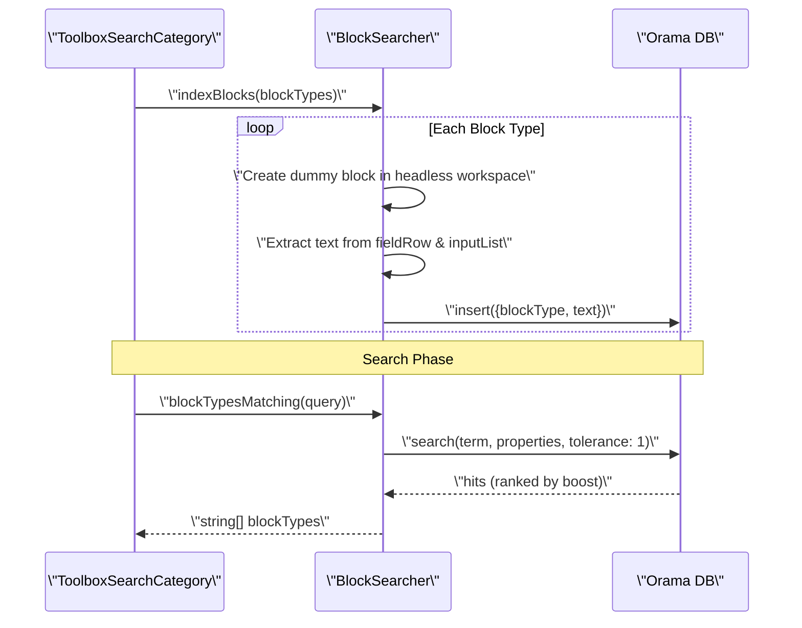

# Block Plugins and Extensions

<details>
<summary>Relevant source files</summary>

The following files were used as context for generating this wiki page:

- [src/app/editors/blockly-editor/components/blockly/custom-field/field-bitmap-u8g2.ts](src/app/editors/blockly-editor/components/blockly/custom-field/field-bitmap-u8g2.ts)
- [src/app/editors/blockly-editor/components/blockly/custom-field/field-image-preview.ts](src/app/editors/blockly-editor/components/blockly/custom-field/field-image-preview.ts)
- [src/app/editors/blockly-editor/components/blockly/custom-field/field-led-matrix-image.ts](src/app/editors/blockly-editor/components/blockly/custom-field/field-led-matrix-image.ts)
- [src/app/editors/blockly-editor/components/blockly/plugins/block-plus-minus/src/dynamic-inputs.js](src/app/editors/blockly-editor/components/blockly/plugins/block-plus-minus/src/dynamic-inputs.js)
- [src/app/editors/blockly-editor/components/blockly/plugins/block-plus-minus/src/index.js](src/app/editors/blockly-editor/components/blockly/plugins/block-plus-minus/src/index.js)
- [src/app/editors/blockly-editor/components/blockly/plugins/toolbox-search/src/block_searcher.ts](src/app/editors/blockly-editor/components/blockly/plugins/toolbox-search/src/block_searcher.ts)
- [src/app/editors/blockly-editor/components/blockly/plugins/toolbox-search/src/toolbox_search.ts](src/app/editors/blockly-editor/components/blockly/plugins/toolbox-search/src/toolbox_search.ts)
- [src/app/editors/blockly-editor/components/blockly/plugins/workspace-multiselect/global.js](src/app/editors/blockly-editor/components/blockly/plugins/workspace-multiselect/global.js)
- [src/app/editors/blockly-editor/components/blockly/plugins/workspace-multiselect/multiselect.js](src/app/editors/blockly-editor/components/blockly/plugins/workspace-multiselect/multiselect.js)
- [src/app/editors/blockly-editor/components/blockly/plugins/workspace-multiselect/multiselect_contextmenu.js](src/app/editors/blockly-editor/components/blockly/plugins/workspace-multiselect/multiselect_contextmenu.js)
- [src/app/editors/blockly-editor/components/blockly/plugins/workspace-multiselect/multiselect_shortcut.js](src/app/editors/blockly-editor/components/blockly/plugins/workspace-multiselect/multiselect_shortcut.js)
- [src/app/editors/blockly-editor/components/blockly/renderer/aily-icon/acon.ts](src/app/editors/blockly-editor/components/blockly/renderer/aily-icon/acon.ts)
- [src/app/editors/blockly-editor/components/blockly/renderer/aily-icon/icon.ts](src/app/editors/blockly-editor/components/blockly/renderer/aily-icon/icon.ts)
- [src/app/editors/blockly-editor/components/blockly/renderer/aily-icon/index.ts](src/app/editors/blockly-editor/components/blockly/renderer/aily-icon/index.ts)
- [src/app/editors/blockly-editor/components/blockly/renderer/aily-thrasos/drawer.ts](src/app/editors/blockly-editor/components/blockly/renderer/aily-thrasos/drawer.ts)
- [src/app/editors/blockly-editor/components/blockly/renderer/aily-thrasos/info.ts](src/app/editors/blockly-editor/components/blockly/renderer/aily-thrasos/info.ts)
- [src/app/editors/blockly-editor/components/blockly/renderer/aily-thrasos/path_object.ts](src/app/editors/blockly-editor/components/blockly/renderer/aily-thrasos/path_object.ts)
- [src/app/editors/blockly-editor/components/blockly/renderer/aily-thrasos/renderer.ts](src/app/editors/blockly-editor/components/blockly/renderer/aily-thrasos/renderer.ts)
- [src/app/editors/blockly-editor/components/paste-install-dialog/paste-install-dialog.component.html](src/app/editors/blockly-editor/components/paste-install-dialog/paste-install-dialog.component.html)
- [src/app/editors/blockly-editor/components/paste-install-dialog/paste-install-dialog.component.scss](src/app/editors/blockly-editor/components/paste-install-dialog/paste-install-dialog.component.scss)
- [src/app/editors/blockly-editor/components/paste-install-dialog/paste-install-dialog.component.ts](src/app/editors/blockly-editor/components/paste-install-dialog/paste-install-dialog.component.ts)
- [src/app/editors/blockly-editor/services/bitmap-upload.service.ts](src/app/editors/blockly-editor/services/bitmap-upload.service.ts)

</details>

This document covers the custom Blockly plugins and extensions that enhance the visual programming environment in Aily Blockly. These plugins extend the core Blockly functionality with specialized field types, search capabilities, dynamic input management, and advanced workspace interactions.

## Plugin Architecture Overview

The Aily Blockly system implements several custom plugins that extend Blockly's capabilities through its registry system. These plugins fall into three main categories: custom field types for specialized hardware input, toolbox enhancements for block discovery, and workspace interaction improvements like multiselect and dynamic mutators.

```mermaid
graph TB
    subgraph \"Blockly_Core_Registry_System\"
        FR[\"Blockly.fieldRegistry\"]
        TR[\"Blockly.registry.Type.TOOLBOX_ITEM\"]
        SR[\"Blockly.ShortcutRegistry\"]
        RR[\"Blockly.blockRendering\"]
    end

    subgraph \"Custom_Field_Types\"
        FBU[\"FieldBitmapU8g2\"]
        FLM[\"FieldLedMatrixImage\"]
    end

    subgraph \"Toolbox_Extensions\"
        TSC[\"ToolboxSearchCategory\"]
        BS[\"BlockSearcher\"]
    end

    subgraph \"Workspace_Extensions\"
        MS[\"MultiselectPlugin\"]
        DIM[\"dynamicInputsMutator\"]
    end

    subgraph \"Rendering_Engine\"
        ATR[\"aily-thrasos Renderer\"]
    end

    FBU --> FR
    FLM --> FR
    TSC --> TR
    MS --> SR
    DIM --> SR
    ATR --> RR

    TSC --> BS
```

**Plugin Registration Architecture**

Sources: [src/app/editors/blockly-editor/components/blockly/custom-field/field-bitmap-u8g2.ts:114-121](), [src/app/editors/blockly-editor/components/blockly/custom-field/field-led-matrix-image.ts:113-119](), [src/app/editors/blockly-editor/components/blockly/plugins/toolbox-search/src/toolbox_search.ts:211-215](), [src/app/editors/blockly-editor/components/blockly/renderer/aily-thrasos/renderer.ts:45-45]()

## Custom Field Types

Aily Blockly includes specialized field types that provide advanced input methods for specific hardware programming scenarios, particularly for displays and LED matrices.

### LED Matrix and Bitmap Fields

The `FieldLedMatrixImage` and `FieldBitmapU8g2` allow users to create pixel-based graphics through an interactive grid editor.

- **FieldLedMatrixImage**: Supports both `mono` (monochrome) and `rgb` modes. It includes a built-in color picker for RGB mode and handles matrix resizing dynamically [src/app/editors/blockly-editor/components/blockly/custom-field/field-led-matrix-image.ts:29-37]().
- **FieldBitmapU8g2**: Optimized for U8g2 library monochrome bitmaps, typically used for OLED displays [src/app/editors/blockly-editor/components/blockly/custom-field/field-bitmap-u8g2.ts:29-32]().

| Feature       | `FieldLedMatrixImage`               | `FieldBitmapU8g2`                  |
| ------------- | ----------------------------------- | ---------------------------------- |
| Data Format   | `LedMatrixImageValue` (mode/pixels) | `number[][]` (binary)              |
| Max Size      | 128x128                             | 128x64 (Default)                   |
| Interaction   | Left click draw, Right click erase  | Left click draw, Right click erase |
| Serialization | `this.SERIALIZABLE = true`          | `this.SERIALIZABLE = true`         |

Sources: [src/app/editors/blockly-editor/components/blockly/custom-field/field-led-matrix-image.ts:42-111](), [src/app/editors/blockly-editor/components/blockly/custom-field/field-bitmap-u8g2.ts:69-106]()

## Toolbox Search Plugin

The toolbox search plugin provides real-time block discovery using the **Orama** search engine. It creates a dedicated search category in the toolbox.

### BlockSearcher Implementation

The `BlockSearcher` class indexes blocks by their type and human-readable text. It uses a `MandarinTokenizer` to support Chinese language search [src/app/editors/blockly-editor/components/blockly/plugins/toolbox-search/src/block_searcher.ts:20-27]().



**Search Indexing and Query Flow**

Sources: [src/app/editors/blockly-editor/components/blockly/plugins/toolbox-search/src/block_searcher.ts:39-68](), [src/app/editors/blockly-editor/components/blockly/plugins/toolbox-search/src/block_searcher.ts:94-109]()

## Workspace Multiselect and Clipboard

The multiselect plugin enables selecting multiple blocks via shift-click or drag-box, supporting group operations like move, delete, and copy/paste.

### Enriched Clipboard Data

When copying blocks, Aily Blockly captures not just the block XML/JSON, but also library metadata to ensure the environment is consistent when pasting across different projects or instances [src/app/editors/blockly-editor/components/blockly/plugins/workspace-multiselect/global.js:160-185]().

```mermaid
graph LR
    subgraph \"Clipboard_Structure\"
        EF[\"Format: 'aily-blockly-clipboard'\"]
        BS[\"blocks: JSON[]\"]
        CS[\"connections: connectionDBList\"]
        LS[\"libraries: { [type]: {name, version} }\"]
    end

    subgraph \"Paste_Logic\"
        CMP[\"checkMissingBlockTypes()\"]
        PID[\"PasteInstallDialog\"]
        BIP[\"Blockly.clipboard.paste()\"]
    end

    EF --> CMP
    LS --> CMP
    CMP -- \"Missing Libs Detected\" --> PID
    PID -- \"User Approves Install\" --> BIP
```

**Enriched Clipboard and Dependency Check**

Sources: [src/app/editors/blockly-editor/components/blockly/plugins/workspace-multiselect/global.js:146-189](), [src/app/editors/blockly-editor/components/paste-install-dialog/paste-install-dialog.component.ts:68-77]()

## Dynamic Inputs (Plus/Minus)

The `dynamicInputsMutator` allows blocks to have a variable number of inputs without using the standard Blockly mutator bubble. It adds `+` and `-` fields directly onto the block surface [src/app/editors/blockly-editor/components/blockly/plugins/block-plus-minus/src/dynamic-inputs.js:8-14]().

Key functions:

- `updateShape_(targetCount)`: Synchronizes the block's physical inputs with the `extraCount_` state [src/app/editors/blockly-editor/components/blockly/plugins/block-plus-minus/src/dynamic-inputs.js:83-103]().
- `addInput_()`: Appends a new value input and attaches a minus field if above `minInputs` [src/app/editors/blockly-editor/components/blockly/plugins/block-plus-minus/src/dynamic-inputs.js:151-166]().
- `removeInput_(displayIndex)`: Disconnects blocks, shifts subsequent connections up, and removes the last input to maintain order [src/app/editors/blockly-editor/components/blockly/plugins/block-plus-minus/src/dynamic-inputs.js:174-231]().

Sources: [src/app/editors/blockly-editor/components/blockly/plugins/block-plus-minus/src/dynamic-inputs.js:16-51]()

## aily-thrasos Renderer

The `Renderer` extends `Blockly.thrasos.Renderer` to provide a custom visual style and automatic icon injection for blocks [src/app/editors/blockly-editor/components/blockly/renderer/aily-thrasos/renderer.ts:12-15]().

### Icon Injection

During the `makeRenderInfo_` phase, the renderer checks the block type against a definition map (`getBlockDefinition`). If an icon (usually FontAwesome) is defined for that block type, it calls `addAilyIconToBlock` to inject a custom `Icon` object into the block's view [src/app/editors/blockly-editor/components/blockly/renderer/aily-thrasos/renderer.ts:21-31]().

The `Icon` class (`aily-icon/icon.ts`) supports three types of visuals:

1.  **image**: Standard SVG/PNG images via `xlink:href` [src/app/editors/blockly-editor/components/blockly/renderer/aily-icon/icon.ts:75-90]().
2.  **svg**: Inline SVG path data [src/app/editors/blockly-editor/components/blockly/renderer/aily-icon/icon.ts:91-104]().
3.  **i**: Font icons (FontAwesome) rendered inside a `foreignObject` [src/app/editors/blockly-editor/components/blockly/renderer/aily-icon/icon.ts:105-111]().

Sources: [src/app/editors/blockly-editor/components/blockly/renderer/aily-thrasos/renderer.ts:1-46](), [src/app/editors/blockly-editor/components/blockly/renderer/aily-icon/icon.ts:15-39]()
