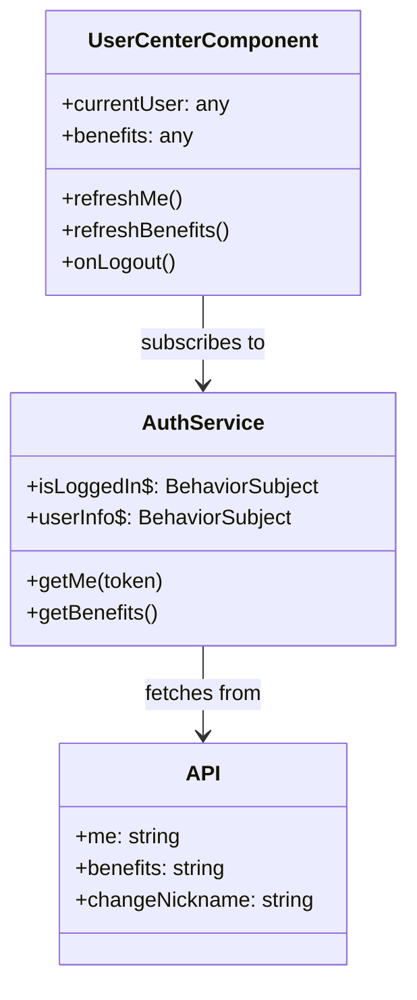

# Authentication and User Management

<details>
<summary>Relevant source files</summary>

The following files were used as context for generating this wiki page:

- [src/app/components/login/altcha/altcha.component.css](src/app/components/login/altcha/altcha.component.css)
- [src/app/components/login/altcha/altcha.component.html](src/app/components/login/altcha/altcha.component.html)
- [src/app/components/login/altcha/altcha.component.ts](src/app/components/login/altcha/altcha.component.ts)
- [src/app/components/login/login.component.html](src/app/components/login/login.component.html)
- [src/app/components/login/login.component.scss](src/app/components/login/login.component.scss)
- [src/app/components/login/login.component.ts](src/app/components/login/login.component.ts)
- [src/app/configs/api.config.ts](src/app/configs/api.config.ts)
- [src/app/main-window/components/login-dialog/login-dialog.component.html](src/app/main-window/components/login-dialog/login-dialog.component.html)
- [src/app/main-window/components/login-dialog/login-dialog.component.scss](src/app/main-window/components/login-dialog/login-dialog.component.scss)
- [src/app/main-window/components/login-dialog/login-dialog.component.ts](src/app/main-window/components/login-dialog/login-dialog.component.ts)
- [src/app/services/auth.service.ts](src/app/services/auth.service.ts)
- [src/app/tools/user-center/user-center.component.html](src/app/tools/user-center/user-center.component.html)
- [src/app/tools/user-center/user-center.component.scss](src/app/tools/user-center/user-center.component.scss)
- [src/app/tools/user-center/user-center.component.ts](src/app/tools/user-center/user-center.component.ts)

</details>

This document describes the authentication and user management system in Aily Blockly. The system supports multiple login methods, secure token persistence using Electron's native capabilities, and a comprehensive user center for managing subscriptions and benefits.

## Authentication Architecture

The authentication system is centered around the `AuthService`, which manages the user lifecycle, token operations, and communication with the backend API.

**Authentication Data Flow**

```mermaid
graph TB
    subgraph \"Renderer Process (Angular)\"
        LoginComponent[\"LoginComponent\"]
        AuthService[\"AuthService\"]
        UserCenter[\"UserCenterComponent\"]
        Altcha[\"AltchaComponent\"]
    end

    subgraph \"Electron Main / Preload\"
        ElectronAPI[\"electronAPI (safeStorage)\"]
    end

    subgraph \"Backend Services\"
        API_Server[\"Aily API Server\"]
        GitHub_OAuth[\"GitHub OAuth\"]
        WeChat_Server[\"WeChat Gateway\"]
    end

    LoginComponent --> AuthService
    AuthService --> Altcha
    AuthService -- \"JWT / SSO\" --> API_Server
    AuthService -- \"Save/Load Token\" --> ElectronAPI
    UserCenter --> AuthService

    API_Server -- \"Authorize\" --> GitHub_OAuth
    API_Server -- \"Ticket/QR\" --> WeChat_Server
```

Sources: [src/app/services/auth.service.ts:61-96](), [src/app/components/login/login.component.ts:108-131](), [src/app/configs/api.config.ts:69-127]()

## Login Methods and Workflows

Aily Blockly supports three primary authentication flows: Email OTP, GitHub OAuth, and WeChat QR code login.

### Email OTP Login

Users can log in by providing an email address and a one-time password (OTP).

1.  **Anti-Bot Check**: The `AltchaComponent` triggers a proof-of-work challenge via the `/api/v1/altcha` endpoint [src/app/components/login/altcha/altcha.component.ts:43-43]().
2.  **Verification Code**: `AuthService.sendEmailCode` requests a code from the server [src/app/services/auth.service.ts:177-190]().
3.  **Authentication**: `AuthService.loginByEmail` submits the email and code to receive a JWT [src/app/services/auth.service.ts:195-213]().

### GitHub OAuth

1.  **Browser Authorization**: The app calls `startGitHubOAuth()` which opens the system browser to the GitHub authorization URL [src/app/main-window/components/login-dialog/login-dialog.component.ts:115-134]().
2.  **Token Exchange**: After the user authorizes, the backend exchanges the code for a token and notifies the app via a deep link or polling.

### WeChat Login (CN Region Only)

Used primarily in the Chinese region [src/app/components/login/login.component.ts:133-135]().

1.  **QR Generation**: The app requests a ticket and QR URL from `API.wechatQrcode` [src/app/configs/api.config.ts:89-89]().
2.  **Polling**: `LoginComponent` starts a 60-second polling interval to check the status of the ticket [src/app/components/login/login.component.ts:183-184]().
3.  **Binding**: If a new user logs in via WeChat, they may be prompted to \"complete email binding\" to finalize the account [src/app/components/login/login.component.ts:62-70]().

Sources: [src/app/services/auth.service.ts:142-213](), [src/app/components/login/login.component.ts:164-200](), [src/app/components/login/altcha/altcha.component.ts:105-144]()

## Security and Persistence

### JWT Persistence via safeStorage

To prevent token theft, Aily Blockly utilizes Electron's `safeStorage` API to encrypt tokens before saving them to the local disk.

| Action             | Logic                                   | File Reference                               |
| :----------------- | :-------------------------------------- | :------------------------------------------- |
| **Save Token**     | `this.electronService.saveToken(token)` | [src/app/services/auth.service.ts:285-288]() |
| **Retrieve Token** | `this.electronService.getToken()`       | [src/app/services/auth.service.ts:290-293]() |
| **Clear Token**    | `this.electronService.deleteToken()`    | [src/app/services/auth.service.ts:311-315]() |

### SSO Token Generation

For tools hosted in sub-windows or external browsers (like the AI Tool Web), the system generates short-lived SSO tokens.

- **Function**: `AuthService.generateSSOToken()` calls the `/api/v1/auth/sso/generate` endpoint [src/app/services/auth.service.ts:317-323]().
- **Usage**: These tokens allow seamless authentication into Aily web services without re-entering credentials [src/app/services/auth.service.ts:52-56]().

Sources: [src/app/services/auth.service.ts:285-323](), [src/app/configs/api.config.ts:96-96]()

## User Center and Subscription Management

The `UserCenterComponent` provides a dashboard for the authenticated user to view their profile, nicknames, and resource quotas.

**User Entity Mapping**



### Benefit Tracking

The system tracks several resource categories via the `benefits` API [src/app/configs/api.config.ts:82-82]():

- **AI Calls**: Tracks usage of AI agent/chat calls [src/app/tools/user-center/user-center.component.html:41-42]().
- **Cloud Storage**: Monitors space used for cloud projects [src/app/tools/user-center/user-center.component.html:56-57]().
- **IoT Devices**: Limits the number of connected hardware nodes [src/app/tools/user-center/user-center.component.html:71-72]().
- **Points**: Loyalty points for redeeming gifts [src/app/tools/user-center/user-center.component.html:86-87]().

Sources: [src/app/tools/user-center/user-center.component.ts:80-96](), [src/app/tools/user-center/user-center.component.html:34-93](), [src/app/services/auth.service.ts:259-268]()

## Anti-Bot Verification (Altcha)

The `AltchaComponent` implements a proof-of-work (PoW) based verification system to prevent automated registration and spam.

- **Initialization**: Loads the `altcha` library and configuration [src/app/components/login/altcha/altcha.component.ts:17-19]().
- **Challenge Source**: Fetches challenges from the endpoint defined in `API.altchaChallenge` [src/app/components/login/altcha/altcha.component.ts:43-43]().
- **Trigger**: The `triggerVerification()` method returns a `Promise<string>` containing the verification payload required by sensitive API endpoints like `sendEmailCode` [src/app/components/login/altcha/altcha.component.ts:105-144]().

Sources: [src/app/components/login/altcha/altcha.component.ts:1-145](), [src/app/services/auth.service.ts:187-187]()
