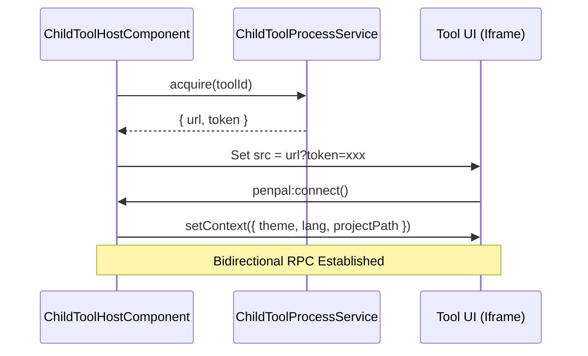

# Extensible Tool Framework

<details>
<summary>Relevant source files</summary>

The following files were used as context for generating this wiki page:

- [.vscode/settings.json](.vscode/settings.json)
- [docs/subapp-development.md](docs/subapp-development.md)
- [docs/tool-development-spec.md](docs/tool-development-spec.md)
- [public/skills/abs-syntax-reference/SKILL.md](public/skills/abs-syntax-reference/SKILL.md)
- [public/skills/blockly-best-practices/SKILL.md](public/skills/blockly-best-practices/SKILL.md)
- [public/skills/library-migration-guide/SKILL.md](public/skills/library-migration-guide/SKILL.md)
- [src/app/components/float-sider/float-sider.component.html](src/app/components/float-sider/float-sider.component.html)
- [src/app/components/float-sider/float-sider.component.scss](src/app/components/float-sider/float-sider.component.scss)
- [src/app/components/float-sider/float-sider.component.ts](src/app/components/float-sider/float-sider.component.ts)
- [src/app/components/sub-window/sub-window.component.html](src/app/components/sub-window/sub-window.component.html)
- [src/app/components/sub-window/sub-window.component.scss](src/app/components/sub-window/sub-window.component.scss)
- [src/app/components/tool-container/tool-container.component.html](src/app/components/tool-container/tool-container.component.html)
- [src/app/components/tool-container/tool-container.component.scss](src/app/components/tool-container/tool-container.component.scss)
- [src/app/configs/tool.config.ts](src/app/configs/tool.config.ts)
- [src/app/services/background-agent.service.ts](src/app/services/background-agent.service.ts)
- [src/app/services/child-tool-process.service.ts](src/app/services/child-tool-process.service.ts)
- [src/app/services/connection-graph.service.ts](src/app/services/connection-graph.service.ts)
- [src/app/tools/aily-chat/core/skill-registry.ts](src/app/tools/aily-chat/core/skill-registry.ts)
- [src/app/tools/aily-chat/services/http-error-handler.service.ts](src/app/tools/aily-chat/services/http-error-handler.service.ts)
- [src/app/tools/aily-chat/services/tiktoken.service.ts](src/app/tools/aily-chat/services/tiktoken.service.ts)
- [src/app/tools/aily-chat/tools/cloneRepositoryTool.ts](src/app/tools/aily-chat/tools/cloneRepositoryTool.ts)
- [src/app/tools/aily-chat/tools/connectionGraphTool.ts](src/app/tools/aily-chat/tools/connectionGraphTool.ts)
- [src/app/tools/aily-chat/tools/loadSkillTool.ts](src/app/tools/aily-chat/tools/loadSkillTool.ts)
- [src/app/tools/aily-chat/tools/registered/schematic-tools.ts](src/app/tools/aily-chat/tools/registered/schematic-tools.ts)
- [src/app/tools/aily-chat/workers/tiktoken.worker.ts](src/app/tools/aily-chat/workers/tiktoken.worker.ts)
- [src/app/tools/app-store/app-store.component.html](src/app/tools/app-store/app-store.component.html)
- [src/app/tools/app-store/app-store.component.scss](src/app/tools/app-store/app-store.component.scss)
- [src/app/tools/app-store/app-store.component.ts](src/app/tools/app-store/app-store.component.ts)
- [src/app/tools/app-store/app-store.config.ts](src/app/tools/app-store/app-store.config.ts)
- [src/app/tools/app-store/app-store.service.ts](src/app/tools/app-store/app-store.service.ts)
- [src/app/tools/child-tool-host/child-tool-host.component.html](src/app/tools/child-tool-host/child-tool-host.component.html)
- [src/app/tools/child-tool-host/child-tool-host.component.scss](src/app/tools/child-tool-host/child-tool-host.component.scss)
- [src/app/tools/child-tool-host/child-tool-host.component.ts](src/app/tools/child-tool-host/child-tool-host.component.ts)
- [src/app/windows/iframe/iframe.component.html](src/app/windows/iframe/iframe.component.html)
- [src/app/windows/iframe/iframe.component.scss](src/app/windows/iframe/iframe.component.scss)
- [src/app/windows/iframe/iframe.component.ts](src/app/windows/iframe/iframe.component.ts)

</details>

The Aily Blockly IDE employs a **two-tier tool architecture** designed to balance high-performance core functionality with a flexible, decoupled ecosystem for specialized hardware debugging and utility applications. This framework allows for the seamless integration of built-in Angular components and independent sub-apps.

## 1. Two-Tier Tool Architecture

The framework categorizes tools into two distinct layers based on their implementation and deployment strategy.

### 1.1. Tier 1: Built-in Angular Tools

These are integrated directly into the main Angular bundle. They are typically core IDE features that require deep access to application services (e.g., `ProjectService`, `ElectronService`).

- **Registration**: Defined in `tool.config.ts` [src/app/configs/tool.config.ts:3-9]().
- **Examples**: AI Assistant (`aily-chat`), Serial Monitor (`serial-debugger`), and the App Store (`app-store`).
- **Hosting**: Rendered via `ToolContainerComponent` [src/app/components/tool-container/tool-container.component.html:1-31]() within the main window's side panels or as `SubWindowComponent` [src/app/components/sub-window/sub-window.component.html:1-10]() in floating windows.

### 1.2. Tier 2: Child Independent Sub-Apps

These are standalone web applications located in `child/tools/`. They run in isolated environments and communicate with the host IDE via a secure IPC bridge.

- **Registration**: Discovered dynamically by scanning the `child/tools/` directory for `package.json` files [src/app/configs/tool.config.ts:100-126]().
- **Examples**: Flash File System Manager (`ffs-manager`), BLE Debugger, and Industrial Bus Debuggers [src/app/configs/tool.config.ts:34-41]().
- **Hosting**: Managed by the `ChildToolHostComponent` [src/app/tools/child-tool-host/child-tool-host.component.ts:33-45]().

### Tool Classification Mapping

The following diagram illustrates how the system maps natural language tool requests to specific code entities.

```mermaid
graph TD
    subgraph \"Natural Language Space\"
        UserReq[\"User clicks 'FFS Manager' or AI invokes 'generate_schematic'\"]
    end

    subgraph \"Code Entity Space\"
        Config[\"tool.config.ts\"]
        Registry[\"getChildToolConfigs()\"]
        Host[\"ChildToolHostComponent\"]
        Process[\"ChildToolProcessService\"]

        UserReq -->|Lookup| Config
        Config -->|Scan child/tools/| Registry
        Registry -->|Load Metadata| Host
        Host -->|Lifecycle Management| Process
    end

    Sources[\"Sources: src/app/configs/tool.config.ts, src/app/tools/child-tool-host/child-tool-host.component.ts\"]
```

## 2. Child Tool Lifecycle and Hosting

Independent sub-apps are hosted within an `<iframe>` inside the `ChildToolHostComponent`. This component manages the transition from an \"idle\" state to a \"ready\" state through a managed backend process.

### 2.1. Process Lifecycle Management

The `ChildToolProcessService` handles the underlying Node.js process for tools that require a backend.

1.  **Acquire**: When a tool is opened, the host calls `processService.acquire(toolId)` [src/app/tools/child-tool-host/child-tool-host.component.ts:224-226]().
2.  **Start**: The service executes the `entry` script (e.g., `index.js`) defined in the tool's `package.json` [src/app/configs/tool.config.ts:148-152]().
3.  **Ready**: Once the tool's backend server is up, the host receives a URL and token [src/app/tools/child-tool-host/child-tool-host.component.ts:230-234]().
4.  **Release**: When the tool is closed, `processService.release(toolId)` is called to terminate the backend [src/app/tools/child-tool-host/child-tool-host.component.ts:125-128]().

### 2.2. Communication Bridge (Penpal)

Communication between the Angular host and the child `<iframe>` uses the `Penpal` library for secure, promise-based RPC.

- **Host to Child**: The host pushes context (theme, language, project path) via `remoteApi.setContext()` [src/app/tools/child-tool-host/child-tool-host.component.ts:331-344]().
- **Child to Host**: The child can invoke host methods such as `showNotification`, `openUrl`, or `executeCommand` [src/app/tools/child-tool-host/child-tool-host.component.ts:275-300]().



_Sources: [src/app/tools/child-tool-host/child-tool-host.component.ts:148-163](), [src/app/services/child-tool-process.service.ts]()_

## 3. Skill Registry and AI Capabilities

The framework extends tools to the AI Assistant via a **Skill Registry**. This allows the AI agent to understand and invoke tool-specific functions.

### 3.1. Tool Registration for AI

Tools are registered in the `aily-chat` environment to provide functional capabilities to the LLM. For example, the `connectionGraphTool` provides the following capabilities:

- `get_pinmap_summary`: Retrieves hardware pin definitions [src/app/tools/aily-chat/tools/connectionGraphTool.ts:101-120]().
- `generate_schematic`: Proposes wiring diagrams based on project requirements [src/app/tools/aily-chat/tools/connectionGraphTool.ts:61-65]().

### 3.2. Background Agent Service

The `BackgroundAgentService` allows the IDE to run complex tool-based tasks in the background without blocking the main chat UI. It manages its own `sessionId` and `conversationMessages` [src/app/services/background-agent.service.ts:112-120]().

- **State Management**: It tracks progress through states like `thinking`, `tool_call`, and `tool_result` [src/app/services/background-agent.service.ts:62-68]().
- **Tool Execution**: It executes tools like `read_file`, `edit_file`, and `generate_schematic` autonomously [src/app/services/background-agent.service.ts:81-105]().

### AI Tool Invocation Flow

This diagram bridges the user's intent to the actual code execution of AI tools.

```mermaid
graph LR
    subgraph \"Natural Language Space\"
        Intent[\"'Connect DHT20 to ESP32'\"]
    end

    subgraph \"Code Entity Space\"
        Agent[\"BackgroundAgentService\"]
        ToolFn[\"generateConnectionGraphTool()\"]
        Srv[\"ConnectionGraphService\"]
        Proj[\"ProjectService\"]

        Intent --> Agent
        Agent -->|Invokes| ToolFn
        ToolFn -->|Reads Board| Proj
        ToolFn -->|Calculates Pins| Srv
    end

    Sources[\"Sources: src/app/services/background-agent.service.ts, src/app/tools/aily-chat/tools/connectionGraphTool.ts\"]
```

## 4. Security and Isolation

To ensure stability and security, the framework implements several layers of isolation:

| Feature                  | Implementation                                                                                                                                                      |
| :----------------------- | :------------------------------------------------------------------------------------------------------------------------------------------------------------------ |
| **UI Isolation**         | Each child tool runs in its own `<iframe>` with a unique origin [src/app/windows/iframe/iframe.component.ts:160-173]().                                             |
| **Token-based Security** | Backend servers require a unique token generated per session to prevent unauthorized access [src/app/tools/child-tool-host/child-tool-host.component.ts:230-234](). |
| **Resource Limits**      | Startup timeouts are enforced via `startupTimeoutMs` in `tool.config.ts` to prevent hanging processes [src/app/configs/tool.config.ts:25-27]().                     |
| **Communication**        | Restricted to `postMessage` via Penpal; no direct access to the `window` object of the host [src/app/tools/child-tool-host/child-tool-host.component.ts:260-270](). |

_Sources: [src/app/configs/tool.config.ts](), [src/app/tools/child-tool-host/child-tool-host.component.ts](), [src/app/windows/iframe/iframe.component.ts]()_
