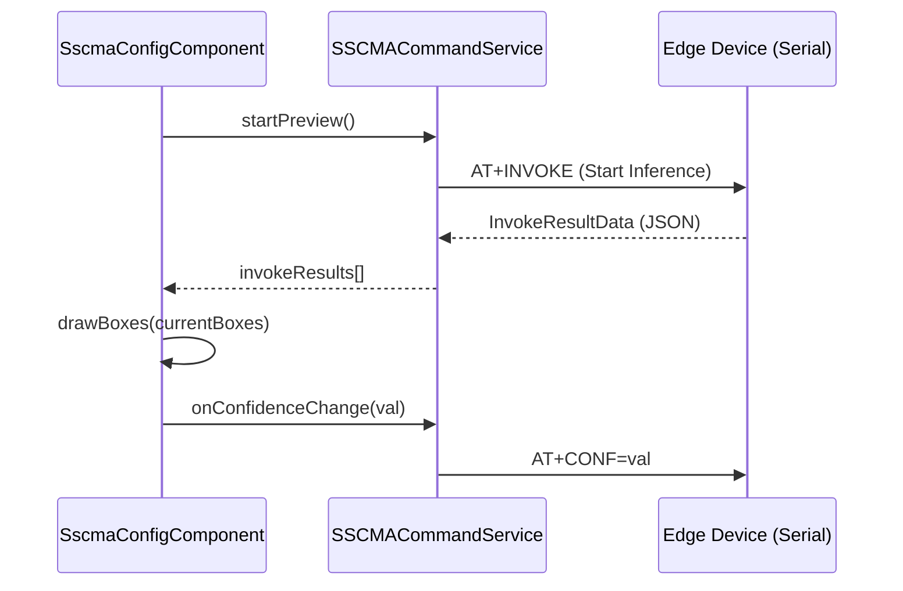

# AI Model Store and Deployment

<details>
<summary>Relevant source files</summary>

The following files were used as context for generating this wiki page:

- [public/model/xiao.webp](public/model/xiao.webp)
- [src/app/services/model-train.service.ts](src/app/services/model-train.service.ts)
- [src/app/services/sscma-command.service.ts](src/app/services/sscma-command.service.ts)
- [src/app/tools/cloud-space/cloud-space.component.html](src/app/tools/cloud-space/cloud-space.component.html)
- [src/app/tools/cloud-space/cloud-space.component.scss](src/app/tools/cloud-space/cloud-space.component.scss)
- [src/app/tools/model-store/model-constants.ts](src/app/tools/model-store/model-constants.ts)
- [src/app/tools/model-store/model-detail/model-detail.component.html](src/app/tools/model-store/model-detail/model-detail.component.html)
- [src/app/tools/model-store/model-detail/model-detail.component.scss](src/app/tools/model-store/model-detail/model-detail.component.scss)
- [src/app/tools/model-store/model-detail/model-detail.component.ts](src/app/tools/model-store/model-detail/model-detail.component.ts)
- [src/app/tools/model-store/model-store.component.html](src/app/tools/model-store/model-store.component.html)
- [src/app/tools/model-store/model-store.component.scss](src/app/tools/model-store/model-store.component.scss)
- [src/app/tools/model-store/model-store.component.ts](src/app/tools/model-store/model-store.component.ts)
- [src/app/tools/model-store/model-store.service.ts](src/app/tools/model-store/model-store.service.ts)
- [src/app/windows/model-deploy/model-deploy.component.html](src/app/windows/model-deploy/model-deploy.component.html)
- [src/app/windows/model-deploy/model-deploy.component.ts](src/app/windows/model-deploy/model-deploy.component.ts)
- [src/app/windows/model-deploy/sscma-config/sscma-config.component.html](src/app/windows/model-deploy/sscma-config/sscma-config.component.html)
- [src/app/windows/model-deploy/sscma-config/sscma-config.component.scss](src/app/windows/model-deploy/sscma-config/sscma-config.component.scss)
- [src/app/windows/model-deploy/sscma-config/sscma-config.component.ts](src/app/windows/model-deploy/sscma-config/sscma-config.component.ts)
- [src/app/windows/model-deploy/sscma-deploy/sscma-deploy.component.html](src/app/windows/model-deploy/sscma-deploy/sscma-deploy.component.html)
- [src/app/windows/model-deploy/sscma-deploy/sscma-deploy.component.scss](src/app/windows/model-deploy/sscma-deploy/sscma-deploy.component.scss)
- [src/app/windows/model-deploy/sscma-deploy/sscma-deploy.component.ts](src/app/windows/model-deploy/sscma-deploy/sscma-deploy.component.ts)
- [src/app/windows/model-train/model-train.component.html](src/app/windows/model-train/model-train.component.html)
- [src/app/windows/model-train/model-train.component.scss](src/app/windows/model-train/model-train.component.scss)
- [src/app/windows/model-train/model-train.component.ts](src/app/windows/model-train/model-train.component.ts)
- [src/app/windows/model-train/vision-train/classification-train/classification-train.component.html](src/app/windows/model-train/vision-train/classification-train/classification-train.component.html)
- [src/app/windows/model-train/vision-train/classification-train/classification-train.component.scss](src/app/windows/model-train/vision-train/classification-train/classification-train.component.scss)
- [src/app/windows/model-train/vision-train/classification-train/classification-train.component.ts](src/app/windows/model-train/vision-train/classification-train/classification-train.component.ts)
- [src/app/windows/model-train/vision-train/vision-train.component.html](src/app/windows/model-train/vision-train/vision-train.component.html)
- [src/app/windows/model-train/vision-train/vision-train.component.ts](src/app/windows/model-train/vision-train/vision-train.component.ts)
- [src/app/workers/model-train.worker.ts](src/app/workers/model-train.worker.ts)

</details>

The AI Model Store and Deployment system provides a streamlined workflow for discovering, previewing, and flashing AI models to edge devices (primarily Seeed Studio XIAO ESP32S3). It integrates the SenseCraft AI ecosystem, allowing users to move from model selection to hardware deployment within the IDE.

## 1. Model Store Architecture

The Model Store is a visual browser for AI models hosted on SenseCraft. It handles pagination, search, and categorization (Vision/Audio) using a responsive grid layout.

### Key Components and Services

- **`ModelStoreComponent`**: Manages the store UI, including search keyword filtering and dynamic page size calculation based on container dimensions [src/app/tools/model-store/model-store.component.ts:36-110]().
- **`ModelStoreService`**: Provides the data layer, fetching model lists and details from the SenseCraft API [src/app/tools/model-store/model-store.service.ts:97-164]().
- **`ModelDetailComponent`**: Displays specific model metadata (task type, precision, size) and triggers the deployment pipeline [src/app/tools/model-store/model-detail/model-detail.component.ts:35-147]().

### Model Data Flow

The system fetches model information from regional APIs defined in `API.config`.

| Entity          | Role                                               | Source                                                       |
| :-------------- | :------------------------------------------------- | :----------------------------------------------------------- |
| `ModelItem`     | Summary data for store cards (ID, author, pic_url) | [src/app/tools/model-store/model-store.service.ts:7-30]()    |
| `ModelDetail`   | Full metadata (labels, checksum, uniform_types)    | [src/app/tools/model-store/model-store.service.ts:52-86]()   |
| `API.modelList` | Dynamic endpoint for model browsing                | [src/app/tools/model-store/model-store.service.ts:102-102]() |

**Sources:** [src/app/tools/model-store/model-store.component.ts](), [src/app/tools/model-store/model-store.service.ts]()

---

## 2. Model Deployment Pipeline

The deployment process is a multi-step workflow managed by the `SscmaDeployComponent`. It transitions from hardware preparation to flashing and finally to configuration.

### Deployment Workflow Diagram

This diagram bridges the user's intent to the code execution logic.

\"Model Deployment Logic\"

```mermaid
graph TD
    subgraph \"Natural Language Space\"
        A[\"Click 'Deploy'\"] --> B[\"Select Serial Port\"]
        B --> C[\"Start Flashing\"]
        C --> D[\"Configure Thresholds\"]
    end

    subgraph \"Code Entity Space\"
        direction TB
        E[\"ModelDetailComponent.onDeploy()\"] --> F[\"UiService.openWindow('model-deploy/sscma/deploy')\"]
        F --> G[\"SscmaDeployComponent.ngOnInit()\"]
        G --> H[\"SscmaDeployComponent.startDeploy()\"]
        H --> I[\"EsptoolPyService.flashFirmware()\"]
        I --> J[\"SscmaDeployComponent.nextStep()\"]
        J --> K[\"SscmaConfigComponent\"]
    end

    A -.-> E
    B -.-> G
    C -.-> H
    D -.-> K
```

**Sources:** [src/app/tools/model-detail/model-detail.component.ts:108-147](), [src/app/windows/model-deploy/sscma-deploy/sscma-deploy.component.ts:117-181]()

### Deployment Steps

1.  **Preparation**: The IDE detects the required `esptool` environment and retrieves the `FirmwareInfo` for the target board [src/app/windows/model-deploy/sscma-deploy/sscma-deploy.component.ts:186-199]().
2.  **Flashing**: Uses `EsptoolPyService` to flash the AI model binary to the device. It monitors progress and allows for cancellation [src/app/windows/model-deploy/sscma-deploy/sscma-deploy.component.ts:87-94]().
3.  **Verification**: After flashing, the system waits for the device to reboot and respond to AT commands via `SSCMACommandService` [src/app/windows/model-deploy/sscma-deploy/sscma-deploy.component.ts:208-215]().

---

## 3. SSCMA Configuration and Real-time Preview

Once a model is deployed, the `SscmaConfigComponent` provides a dashboard for fine-tuning the AI model's behavior on the edge device.

### Configuration Controls

- **Thresholds**: Users can adjust `confidenceThreshold` and `iouThreshold` (Intersection over Union). Changes are sent to the device via AT commands [src/app/windows/model-deploy/sscma-config/sscma-config.component.ts:165-167]().
- **GPIO Trigger Rules**: Maps model classes to physical hardware pins. For example, \"Turn on LED (GPIO 21) if 'Person' is detected with >70% confidence\" [src/app/windows/model-deploy/sscma-config/sscma-config.component.ts:187-209]().
- **Real-time Preview**: Fetches inference results and image frames from the device, rendering bounding boxes onto an `HTMLCanvasElement` [src/app/windows/model-deploy/sscma-config/sscma-config.component.ts:87-88]().

### SSCMA Communication Diagram

\"SSCMA Command and Control\"



**Sources:** [src/app/windows/model-deploy/sscma-config/sscma-config.component.ts:172-180](), [src/app/services/sscma-command.service.ts]()

---

## 4. Model Training Workflow

The system supports external training workflows for custom AI models.

- **SenseCraft Training**: The IDE provides a direct link to the SenseCraft training portal for vision/audio models [src/app/tools/model-store/model-store.component.ts:249-251]().
- **Model Training Service**: The `ModelTrainService` and `model-train.worker.ts` handle background tasks related to model preparation and local training status (where applicable) [src/app/services/model-train.service.ts](), [src/app/workers/model-train.worker.ts]().
- **Local Training**: Components like `ClassificationTrainComponent` provide UI for vision-based classification training [src/app/windows/model-train/vision-train/classification-train/classification-train.component.ts]().

**Sources:** [src/app/tools/model-store/model-store.component.ts](), [src/app/services/model-train.service.ts]()

---

## 5. Technical Implementation Details

### Data Persistence

To maintain state across the window-based architecture (moving from the main IDE to the deployment sub-window), the system uses `localStorage` as a temporary bridge:

- `current_model_deploy`: Stores the `ModelDetail` JSON [src/app/windows/model-deploy/sscma-deploy/sscma-deploy.component.ts:119-122]().
- `current_model_deploy_port`: Stores the selected serial port path [src/app/windows/model-deploy/sscma-deploy/sscma-deploy.component.ts:129-132]().

### Board Support Metadata

The file `model-constants.ts` contains the mapping of `uniform_types` to human-readable board names and connection instructions [src/app/tools/model-store/model-constants.ts](). This ensures the UI displays the correct connection images and steps for different hardware variants (e.g., Vision vs. Audio) [src/app/windows/model-deploy/sscma-deploy/sscma-deploy.component.ts:163-166]().

**Sources:** [src/app/windows/model-deploy/sscma-deploy/sscma-deploy.component.ts](), [src/app/tools/model-store/model-constants.ts]()
