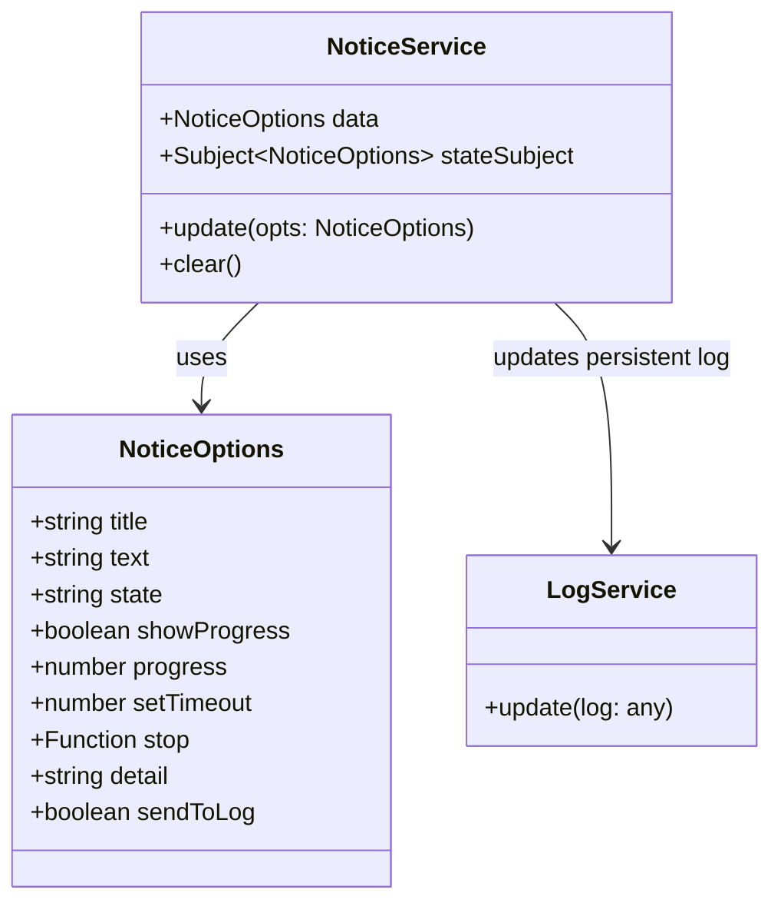

# Notice and State Management

<details>
<summary>Relevant source files</summary>

The following files were used as context for generating this wiki page:

- [.vscode/settings.json](.vscode/settings.json)
- [docs/action.service.README.md](docs/action.service.README.md)
- [src/app/components/float-sider/float-sider.component.html](src/app/components/float-sider/float-sider.component.html)
- [src/app/components/float-sider/float-sider.component.scss](src/app/components/float-sider/float-sider.component.scss)
- [src/app/components/float-sider/float-sider.component.ts](src/app/components/float-sider/float-sider.component.ts)
- [src/app/components/notification/notification.component.html](src/app/components/notification/notification.component.html)
- [src/app/components/notification/notification.component.scss](src/app/components/notification/notification.component.scss)
- [src/app/components/notification/notification.component.ts](src/app/components/notification/notification.component.ts)
- [src/app/editors/code-editor/services/project.service.ts](src/app/editors/code-editor/services/project.service.ts)
- [src/app/services/action.service.ts](src/app/services/action.service.ts)
- [src/app/services/background-agent.service.ts](src/app/services/background-agent.service.ts)
- [src/app/services/connection-graph.service.ts](src/app/services/connection-graph.service.ts)
- [src/app/services/notice.service.ts](src/app/services/notice.service.ts)
- [src/app/services/ui.service.ts](src/app/services/ui.service.ts)
- [src/app/tools/aily-chat/services/http-error-handler.service.ts](src/app/tools/aily-chat/services/http-error-handler.service.ts)
- [src/app/tools/aily-chat/services/tiktoken.service.ts](src/app/tools/aily-chat/services/tiktoken.service.ts)
- [src/app/tools/aily-chat/tools/connectionGraphTool.ts](src/app/tools/aily-chat/tools/connectionGraphTool.ts)
- [src/app/tools/aily-chat/tools/registered/schematic-tools.ts](src/app/tools/aily-chat/tools/registered/schematic-tools.ts)
- [src/app/tools/terminal/terminal.component.html](src/app/tools/terminal/terminal.component.html)
- [src/app/tools/terminal/terminal.component.scss](src/app/tools/terminal/terminal.component.scss)
- [src/app/tools/terminal/terminal.component.ts](src/app/tools/terminal/terminal.component.ts)
- [src/app/windows/iframe/iframe.component.html](src/app/windows/iframe/iframe.component.html)
- [src/app/windows/iframe/iframe.component.scss](src/app/windows/iframe/iframe.component.scss)
- [src/app/windows/iframe/iframe.component.ts](src/app/windows/iframe/iframe.component.ts)

</details>

## Purpose and Scope

This document describes the notification system, UI state management patterns, and background agent coordination within the Aily Blockly IDE. The system utilizes centralized services—`NoticeService`, `UiService`, and `ActionService`—to manage application-wide notifications, window/tool visibility, and visual state indicators for user actions.

## Notice Service Architecture

The `NoticeService` acts as the central hub for broadcasting transient status updates, progress indicators, and persistent error logs.

### Core Service Structure



The `NoticeService` exposes a `stateSubject` for reactive UI updates. When `update()` is called, it can optionally forward the notification detail to the `LogService` for persistent viewing in the diagnostic panel.

Sources: [src/app/services/notice.service.ts:1-53]()

### Notification Lifecycle and UI Integration

The `NotificationComponent` subscribes to the `NoticeService` to render floating alerts. It handles complex behaviors like progress bar animations and ANSI character stripping.

- **ANSI Cleaning**: The component uses `cleanAnsi()` to remove SGR color sequences before displaying text in the UI [src/app/components/notification/notification.component.ts:157-160]().
- **Progress Animation**: It implements a smooth `easeOutQuad` easing function for progress bar transitions [src/app/components/notification/notification.component.ts:122-124]().
- **AI Integration**: Users can click \"Send to AI\" on a notification to pipe the error detail into the chat for troubleshooting [src/app/components/notification/notification.component.ts:169-176]().

Sources: [src/app/components/notification/notification.component.ts:42-68](), [src/app/services/notice.service.ts:20-32]()

## UI State Management

### UiService: Window and Tool Coordination

The `UiService` manages the visibility and focus of main-window tools and standalone sub-windows.

| Function                 | Description                                                                                                                                           |
| ------------------------ | ----------------------------------------------------------------------------------------------------------------------------------------------------- |
| `openTool(name)`         | Opens a tool (e.g., `aily-chat`, `terminal`) in the main window or focuses its sub-window if already open [src/app/services/ui.service.ts:145-163](). |
| `openWindow(opt)`        | Spawns a new Electron sub-window via the `subWindow` preload API [src/app/services/ui.service.ts:130-133]().                                          |
| `updateSubWindowState()` | Tracks which sub-windows are active to prevent duplicate instances [src/app/services/ui.service.ts:202-216]().                                        |
| `openAndSendToChat()`    | Programmatic interface to trigger AI chat with a specific prompt [src/app/services/ui.service.ts:221-224]().                                          |

Sources: [src/app/services/ui.service.ts:18-48]()

### ActionService: Execution State

The `ActionService` tracks the current operational state of the IDE (e.g., `compiling`, `uploading`, `idle`). This state is consumed by the `ActBtnComponent` to show spinners or success/error icons.

Sources: [src/app/services/action.service.ts:1-20]()

## Connection Graph Service

The `ConnectionGraphService` manages the state and data flow for the circuit visualization system. It bridges the gap between AI-generated schematics and the interactive UI.

### Data Flow Diagram

```mermaid
graph TD
    subgraph \"Main Process Space\"
        ProjectService[\"ProjectService\"]
        CGService[\"ConnectionGraphService\"]
        BGAgent[\"BackgroundAgentService\"]
    end

    subgraph \"UI Space (IframeComponent)\"
        Iframe[\"iframe.component.ts\"]
        Penpal[\"Penpal (Bridge)\"]
        SubApp[\"Connection Graph Sub-app\"]
    end

    BGAgent -- \"generate_schematic\" --> CGService
    CGService -- \"read/write JSON\" --> ProjectService
    Iframe -- \"methods.initedGraph()\" --> Penpal
    Penpal -- \"pushDataToRemote()\" --> SubApp
    SubApp -- \"save-graph-data\" --> Penpal
    Penpal -- \"saveGraphData()\" --> CGService
```

Sources: [src/app/services/connection-graph.service.ts:141-158](), [src/app/windows/iframe/iframe.component.ts:219-244]()

### Key Data Entities

- **ConnectionGraphData**: The JSON schema (`connection_output.json`) defining components and their pin-to-pin connections [src/app/services/connection-graph.service.ts:141-146]().
- **PinSummary**: A simplified representation of hardware pins used as context for the LLM [src/app/services/connection-graph.service.ts:161-169]().

## Background Agent Coordination

The `BackgroundAgentService` runs complex AI workflows (like schematic generation) in the background without blocking the main chat interface.

### Agent Workflow

1.  **Session Management**: Generates a unique `sessionId` to maintain a stateless Copilot-style conversation [src/app/services/background-agent.service.ts:202-206]().
2.  **Tool Loop**: Executes a loop where it calls tools (e.g., `generate_schematic`, `read_file`), injects results into the conversation, and requests the next step from the server [src/app/services/background-agent.service.ts:215-222]().
3.  **IPC Feedback**: Pushes real-time thinking status and tool execution results to the `NoticeService` and any active sub-windows [src/app/services/background-agent.service.ts:113-114]().

### Schematic Generation Tool

The `generateConnectionGraphTool` is a critical component that:

- Extracts board pin maps from the project's hardware package [src/app/tools/aily-chat/tools/connectionGraphTool.ts:67-73]().
- Syncs missing component pin maps from the Aily Cloud API [src/app/tools/aily-chat/tools/connectionGraphTool.ts:90-98]().
- Formats hardware/software component summaries for the AI agent [src/app/tools/aily-chat/tools/connectionGraphTool.ts:101-120]().

Sources: [src/app/services/background-agent.service.ts:184-230](), [src/app/tools/aily-chat/tools/connectionGraphTool.ts:61-115]()

## Terminal State and Integration

The IDE integrates `xterm.js` via `TerminalComponent` and `TerminalService`.

- **Lifecycle**: The terminal process is managed in the Electron main process via `node-pty`. The frontend communicates via the `terminal` preload bridge [src/app/tools/terminal/terminal.component.ts:76-78]().
- **Theming**: The terminal dynamically reads CSS variables (e.g., `--aily-editor-bg`) to ensure visual consistency with the IDE theme [src/app/tools/terminal/terminal.component.ts:89-115]().

Sources: [src/app/tools/terminal/terminal.component.ts:52-79]()
