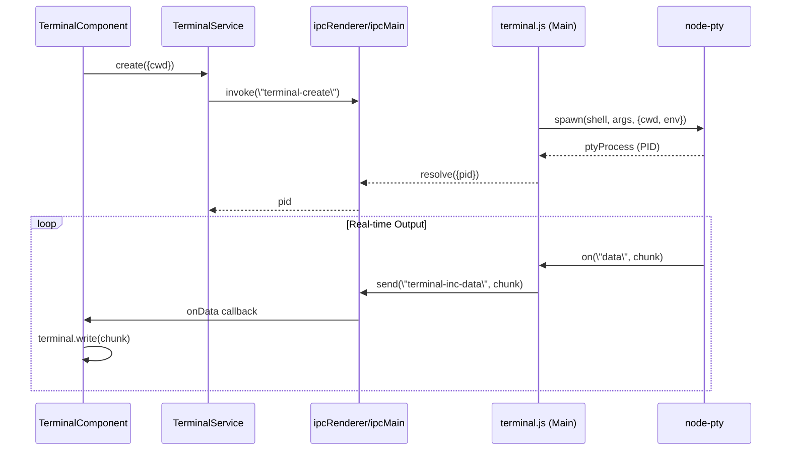

# Terminal Integration

<details>
<summary>Relevant source files</summary>

The following files were used as context for generating this wiki page:

- [electron/terminal.js](electron/terminal.js)
- [src/app/services/builder.service.ts](src/app/services/builder.service.ts)
- [src/app/services/ui.service.ts](src/app/services/ui.service.ts)
- [src/app/services/uploader.service.ts](src/app/services/uploader.service.ts)
- [src/app/tools/terminal/terminal.component.html](src/app/tools/terminal/terminal.component.html)
- [src/app/tools/terminal/terminal.component.scss](src/app/tools/terminal/terminal.component.scss)
- [src/app/tools/terminal/terminal.component.ts](src/app/tools/terminal/terminal.component.ts)
- [src/app/tools/terminal/terminal.service.ts](src/app/tools/terminal/terminal.service.ts)

</details>


## Purpose and Scope

The Terminal Integration system provides an embedded terminal interface within the Aily Blockly IDE for executing development commands, monitoring build processes, and viewing system logs. This system enables developers to interact with underlying command-line tools including Arduino CLI, npm, and system utilities using high-performance pseudo-terminals (PTYs).

The integration leverages `node-pty` for backend process management and `xterm.js` for frontend rendering. It supports cross-platform shell handling, real-time streaming IPC protocols, and complex process tree management to ensure clean termination of build toolchains.

## System Architecture

The terminal system is built on a multi-layered architecture integrating Angular components, Electron IPC communication, and `node-pty` for shell interaction.

### Terminal System Overview

```mermaid
graph TB
    subgraph \"Angular Frontend\"
        TC[\"TerminalComponent\"]
        TS[\"TerminalService\"] 
        US[\"UiService\"]
    end
    
    subgraph \"Terminal UI (Renderer)\"
        XTERM[\"xterm.js Terminal\"]
        FIT[\"FitAddon\"]
    end
    
    subgraph \"Electron Main Process\"
        TH[\"terminal.js Handlers\"]
        PTY[\"node-pty spawn()\"]
        SHELL[\"System Shell (pwsh/zsh/bash)\"]
    end
    
    subgraph \"Process Tree\"
        CLI[\"arduino-cli\"]
        BLD[\"aily-builder\"]
    end
    
    TC --> XTERM
    TC --> TS
    TS -- \"ipcRenderer.invoke('terminal-create')\" --> TH
    TH --> PTY
    PTY --> SHELL
    SHELL --> CLI
    SHELL --> BLD
    
    PTY -- \"pty.onData\" --> TH
    TH -- \"webContents.send('terminal-inc-data')\" --> TC
    TC --> XTERM
```

Sources: [electron/terminal.js:1-24](), [src/app/tools/terminal/terminal.component.ts:52-79](), [src/app/tools/terminal/terminal.service.ts:1-40]()

### Component Integration Flow



Sources: [electron/terminal.js:118-187](), [src/app/tools/terminal/terminal.component.ts:72-79](), [src/app/tools/terminal/terminal.service.ts:17-24]()

## PTY and Shell Management

The system dynamically adapts to the host operating system to provide a native terminal experience.

### Cross-Platform Shell Handling

The IDE selects the appropriate shell and arguments based on `process.platform`:

| Platform | Shell (`shellMap`) | Arguments (`getShellArgs`) |
| :--- | :--- | :--- |
| **Windows** | `powershell.exe` | `[\"-NoProfile\", \"-NoLogo\"]` |
| **macOS** | `zsh` | `[\"-f\"]` |
| **Linux** | `bash` | `[\"--noprofile\", \"--norc\"]` |

Sources: [electron/terminal.js:17-37]()

### Environment and Prompt Detection

To ensure the terminal is ready before sending commands, the system uses regex-based prompt detection:
- **Windows**: Detects PowerShell patterns like `PS D:\path>` [electron/terminal.js:12]().
- **Unix**: Detects standard prompt characters like `#`, `%`, or `>` [electron/terminal.js:13-14]().

The environment is isolated; for example, on macOS, a custom `ZDOTDIR` is created in the temporary directory to prevent interference with user-level shell configurations [electron/terminal.js:41-48]().

## Process Tree Management

One of the critical functions of the terminal integration is the reliable termination of child processes (e.g., stopping a compilation or a hardware flash).

### Process Termination Logic

The `killRegisteredProcessTree` function handles the recursive termination of process trees:
- **Windows**: Executes `taskkill /PID {pid} /T /F` to force-kill the process and all its children [electron/terminal.js:59]().
- **Unix**: Uses `process.kill(pid, 'SIGTERM')` [electron/terminal.js:76]().

The IDE maintains a `terminals` Map in the main process to track active PTY instances and their PIDs, ensuring no \"zombie\" processes remain when a terminal is closed or the app exits [electron/terminal.js:103-110]().

Sources: [electron/terminal.js:51-84](), [electron/terminal.js:103-110]()

## Streaming IPC Protocol

For long-running tasks like `build` or `upload`, the system uses a streaming protocol to provide real-time feedback to the UI.

### Execution with Stream

The `TerminalService` provides an `executeWithStream` method that allows the IDE to execute a command and receive line-by-line callbacks:

1. **Stream Initialization**: `startStream(pid)` is called to get a unique `streamId` [src/app/tools/terminal/terminal.service.ts:56-63]().
2. **Data Buffering**: Raw data chunks from the PTY are buffered and split by `\
` or `\
` to reconstruct complete lines [src/app/tools/terminal/terminal.service.ts:84-147]().
3. **Control Signals**: The system detects `Ctrl+C` (`\u0003`) within the stream to handle user interruptions [src/app/tools/terminal/terminal.service.ts:86-90]().

Sources: [src/app/tools/terminal/terminal.service.ts:74-188]()

## Terminal UI Implementation

The `TerminalComponent` wraps `xterm.js` and provides IDE-specific features like theme synchronization and clipboard integration.

### Theme Synchronization

Terminal colors are dynamically mapped from the application's CSS variables to ensure visual consistency between the editor and the terminal:
- **Background/Foreground**: Mapped to `--aily-editor-bg` and `--aily-text-primary` [src/app/tools/terminal/terminal.component.ts:93-94]().
- **ANSI Colors**: Standard colors (black, red, green, etc.) are pulled from CSS variables like `--aily-terminal-red` [src/app/tools/terminal/terminal.component.ts:98-114]().

### Lifecycle and Resizing

- **Initialization**: `nodePtyInit()` triggers the creation of the backend PTY process with the current project's path as the `cwd` [src/app/tools/terminal/terminal.component.ts:188-194]().
- **Dynamic Resize**: A `ResizeObserver` monitors the terminal container. When the UI layout changes, it uses `FitAddon.proposeDimensions()` to calculate the new grid and notifies the main process via `terminal-resize` [src/app/tools/terminal/terminal.component.ts:120-138]().
- **Cleanup**: On component destruction, the PTY process is killed and the terminal instance is disposed [src/app/tools/terminal/terminal.component.ts:81-86]().

Sources: [src/app/tools/terminal/terminal.component.ts:81-138](), [src/app/tools/terminal/terminal.component.ts:188-194]()

## Uploader and Builder Integration

The terminal system is the execution engine for the `BuilderService` and `UploaderService`.

- **Build Execution**: `BuilderService.build()` dispatches a `compile-begin` action which ultimately executes commands in the terminal context [src/app/services/builder.service.ts:50-84]().
- **Upload Coordination**: `UploaderService` manages the serial port lifecycle, ensuring that the terminal (or serial monitor) releases the COM port before `esptool` or other CLI tools attempt to flash the hardware [src/app/services/uploader.service.ts:24-52]().

Sources: [src/app/services/builder.service.ts:50-84](), [src/app/services/uploader.service.ts:54-88]()
