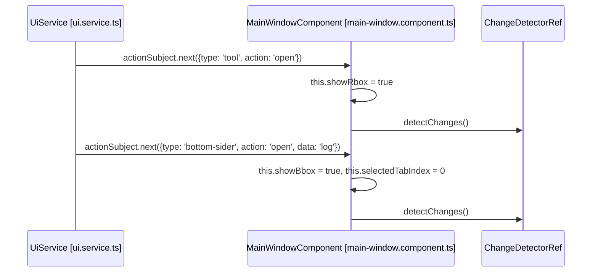

# Main Window Layout

<details>
<summary>Relevant source files</summary>

The following files were used as context for generating this wiki page:

- [src/app/app.routes.ts](src/app/app.routes.ts)
- [src/app/components/feedback-dialog/feedback-dialog.component.html](src/app/components/feedback-dialog/feedback-dialog.component.html)
- [src/app/components/feedback-dialog/feedback-dialog.component.scss](src/app/components/feedback-dialog/feedback-dialog.component.scss)
- [src/app/components/feedback-dialog/feedback-dialog.component.ts](src/app/components/feedback-dialog/feedback-dialog.component.ts)
- [src/app/components/feedback-dialog/feedback.service.ts](src/app/components/feedback-dialog/feedback.service.ts)
- [src/app/components/notification/notification.component.html](src/app/components/notification/notification.component.html)
- [src/app/components/notification/notification.component.scss](src/app/components/notification/notification.component.scss)
- [src/app/components/notification/notification.component.ts](src/app/components/notification/notification.component.ts)
- [src/app/main-window/components/footer/footer.component.html](src/app/main-window/components/footer/footer.component.html)
- [src/app/main-window/components/footer/footer.component.scss](src/app/main-window/components/footer/footer.component.scss)
- [src/app/main-window/components/footer/footer.component.ts](src/app/main-window/components/footer/footer.component.ts)
- [src/app/main-window/main-window.component.html](src/app/main-window/main-window.component.html)
- [src/app/main-window/main-window.component.scss](src/app/main-window/main-window.component.scss)
- [src/app/main-window/main-window.component.ts](src/app/main-window/main-window.component.ts)
- [src/app/services/notice.service.ts](src/app/services/notice.service.ts)
- [src/app/tools/log/log.component.html](src/app/tools/log/log.component.html)
- [src/app/tools/log/log.component.scss](src/app/tools/log/log.component.scss)
- [src/app/tools/log/log.component.ts](src/app/tools/log/log.component.ts)

</details>


This document details the main window layout system of the Aily Blockly IDE. The application uses a three-pane architecture (Editor, Bottom Diagnostics, and Right Sidebar) built on Angular and the `ng-zorro-antd` UI framework. It manages responsive panel structures, resizable components, and a unified tool integration system.

## Layout Architecture

The `MainWindowComponent` serves as the primary layout orchestrator. It manages the visibility and sizing of the header, the main content area (which houses the editor), a resizable right sidebar for tools, and a resizable bottom panel for diagnostics.

```mermaid
graph TB
    MainWindow[\"MainWindowComponent [main-window.component.ts]\"]
    MainWindow --> Header[\"HeaderComponent [header.component.ts]\"]
    MainWindow --> ContentArea[\"Layout Content Area [main-window.component.html]\"]
    MainWindow --> Footer[\"FooterComponent [footer.component.ts]\"]
    
    ContentArea --> MiddleBox[\"Middle Content (.middle-box)\"]
    ContentArea --> RightSidebar[\"Right Sidebar (nz-sider)\"]
    ContentArea --> BottomPanel[\"Bottom Panel (.resizable-box)\"]
    
    MiddleBox --> RouterOutlet[\"router-outlet [app.routes.ts]\"]
    MiddleBox --> Scrollbar[\"ngx-simplebar\"]
    
    RightSidebar --> ToolSwitch[\"Tool Panel Wrapper [main-window.component.html]\"]
    ToolSwitch --> ChildHost[\"ChildToolHostComponent\"]
    ToolSwitch --> BuiltInTools[\"Built-in Angular Tools\"]
    
    BottomPanel --> TabSet[\"nz-tabset\"]
    TabSet --> LogComp[\"LogComponent [log.component.ts]\"]
    TabSet --> TermComp[\"TerminalComponent [terminal.component.ts]\"]
```

**Layout Component Structure**
The layout uses `nz-layout` as the core container [src/app/main-window/main-window.component.html:4](). The height of the content area is calculated to fill the viewport minus the header and footer [src/app/main-window/main-window.component.scss:13-19]().

Sources: [src/app/main-window/main-window.component.html:1-111](), [src/app/main-window/main-window.component.scss:7-19](), [src/app/app.routes.ts:1-54]()

## Panel Management System

The visibility of the right and bottom panels is controlled reactively through the `UiService`. The `MainWindowComponent` subscribes to UI actions to toggle the `showRbox` (Right) and `showBbox` (Bottom) states.



**State Variables**
- `showRbox`: Boolean controlling the `nz-sider` visibility [src/app/main-window/main-window.component.ts:72]().
- `showBbox`: Boolean controlling the bottom resizable box [src/app/main-window/main-window.component.ts:73]().
- `selectedTabIndex`: Tracks the active tab (Log vs. Terminal) in the bottom panel [src/app/main-window/main-window.component.ts:75]().

Sources: [src/app/main-window/main-window.component.ts:152-193](), [src/app/main-window/main-window.component.html:11-107]()

## Resizable Panel Implementation

The layout implements resizable panels using `nz-resizable`, allowing users to adjust dimensions within constraints.

| Panel | Min Size | Max Size | Resize Direction | Code Reference |
| :--- | :--- | :--- | :--- | :--- |
| **Right Sidebar** | 400px width | 800px width | Left (`nzDirection=\"left\"`) | [main-window.component.html:62-63]() |
| **Bottom Panel** | 50px height | 600px height | Top (`nzDirection=\"top\"`) | [main-window.component.html:12]() |

**Resize Event Handlers**
The component updates local variables `siderWidth` and `bottomHeight` during resize events [src/app/main-window/main-window.component.ts:2416-2422](). Visual feedback is provided by custom resize lines [src/app/main-window/main-window.component.scss:207-217]().

Sources: [src/app/main-window/main-window.component.html:12-16](), [src/app/main-window/main-window.component.html:62-66](), [src/app/main-window/main-window.component.scss:207-217]()

## Log Component and ANSI Parsing

The `LogComponent` provides a high-performance, virtualized view of system and hardware logs.

- **ANSI Parsing**: Uses `AnsiPipe` and `fancy-ansi` to convert terminal escape sequences (colors, styles) into HTML [src/app/tools/log/log.component.ts:6-13]().
- **Virtualization**: Implements `TanStack Virtualizer` to handle thousands of log entries with minimal DOM overhead [src/app/tools/log/log.component.ts:48-53]().
- **Data Flow**: Subscribes to `LogService` state changes to refresh the list and auto-scroll to the bottom [src/app/tools/log/log.component.ts:88-96]().
- **Interactivity**: 
    - Single-click: Copies log item to clipboard [src/app/tools/log/log.component.ts:213-219]().
    - Double-click: Sends log content to the AI Chat for analysis [src/app/tools/log/log.component.ts:222-228]().

Sources: [src/app/tools/log/log.component.ts:24-150](), [src/app/tools/log/log.component.html:27-48]()

## Tool Container and Sub-Window Wrappers

The right sidebar acts as a dynamic tool host. It differentiates between built-in Angular components and \"Child Tools\" (independent sub-apps).

```mermaid
graph LR
    ToolList[\"openToolList [UiService]\"] --> Loop[\"@for (tool of openToolList)\"]
    Loop --> IsChild{\"isChildTool(tool)?\"}
    IsChild -->|Yes| ChildHost[\"ChildToolHostComponent [child-tool-host.component.ts]\"]
    IsChild -->|No| Switch[\"@switch (tool)\"]
    
    Switch -->|\"code-viewer\"| CV[\"CodeViewerComponent\"]
    Switch -->|\"serial-monitor\"| SM[\"SerialMonitorComponent\"]
    Switch -->|\"aily-chat\"| AC[\"AilyChatComponent\"]
    Switch -->|\"model-store\"| MS[\"ModelStoreComponent\"]
```

- **Built-in Tools**: Angular components like `SerialMonitorComponent` and `AilyChatComponent` are rendered directly via a switch case [src/app/main-window/main-window.component.html:73-101]().
- **Child Tools**: External tools are loaded via `ChildToolHostComponent`, which typically handles iframe-based or independent process communication [src/app/main-window/main-window.component.html:70-71]().

Sources: [src/app/main-window/main-window.component.html:68-104](), [src/app/main-window/main-window.component.ts:85-87]()

## Onboarding Overlay System

The application includes a guided onboarding system that overlays the main window.

- **Service-Driven**: The `OnboardingService` controls the visibility and configuration of the onboarding steps [src/app/main-window/main-window.component.ts:129-136]().
- **Component**: The `OnboardingComponent` is rendered at the root level of the main window to ensure it covers all other UI elements [src/app/main-window/main-window.component.html:114-118]().
- **Persistence**: Completion status is tracked to ensure the guide only appears for new users or when manually triggered.

Sources: [src/app/main-window/main-window.component.ts:95-98](), [src/app/main-window/main-window.component.html:114-118](), [src/app/main-window/main-window.component.ts:129-136]()

## Notification and Feedback

The main window hosts the global notification system and the feedback dialog.

- **Notifications**: The `NotificationComponent` displays progress bars for long-running tasks (like building or uploading) and allows users to \"View Detail\" in the log or \"AI Process\" the error [src/app/components/notification/notification.component.ts:43-68]().
- **Feedback**: The `FeedbackDialogComponent` allows users to submit bug reports. It automatically gathers system context, including OS version, software version, and the last 20 error logs [src/app/components/feedback-dialog/feedback-dialog.component.ts:172-208]().

Sources: [src/app/components/notification/notification.component.ts:1-178](), [src/app/components/feedback-dialog/feedback-dialog.component.ts:172-208]()
