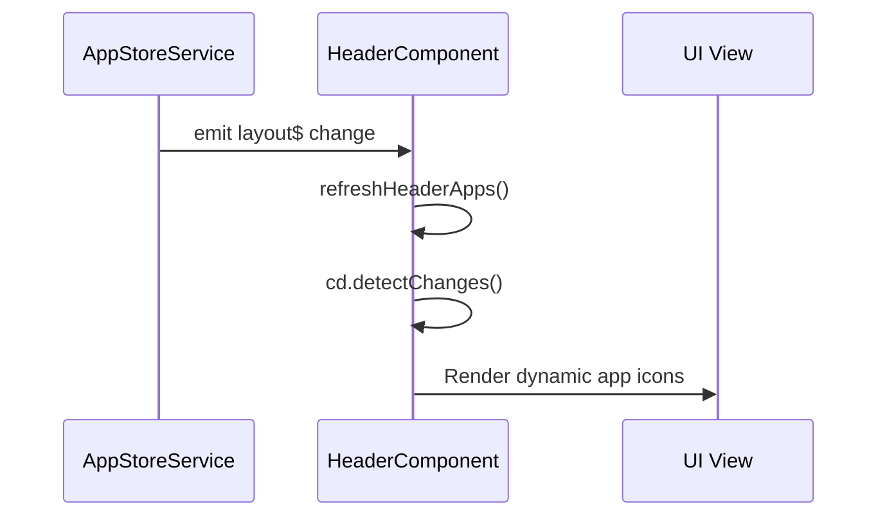

# Header and Controls

<details>
<summary>Relevant source files</summary>

The following files were used as context for generating this wiki page:

- [src/app/components/base-dialog/base-dialog.component.html](src/app/components/base-dialog/base-dialog.component.html)
- [src/app/components/base-dialog/base-dialog.component.scss](src/app/components/base-dialog/base-dialog.component.scss)
- [src/app/components/base-dialog/base-dialog.component.ts](src/app/components/base-dialog/base-dialog.component.ts)
- [src/app/components/menu/menu.component.html](src/app/components/menu/menu.component.html)
- [src/app/components/menu/menu.component.scss](src/app/components/menu/menu.component.scss)
- [src/app/components/menu/menu.component.ts](src/app/components/menu/menu.component.ts)
- [src/app/configs/menu.config.ts](src/app/configs/menu.config.ts)
- [src/app/main-window/components/act-btn/act-btn.component.html](src/app/main-window/components/act-btn/act-btn.component.html)
- [src/app/main-window/components/act-btn/act-btn.component.scss](src/app/main-window/components/act-btn/act-btn.component.scss)
- [src/app/main-window/components/act-btn/act-btn.component.ts](src/app/main-window/components/act-btn/act-btn.component.ts)
- [src/app/main-window/components/board-selector-dialog/board-selector-dialog.component.html](src/app/main-window/components/board-selector-dialog/board-selector-dialog.component.html)
- [src/app/main-window/components/board-selector-dialog/board-selector-dialog.component.scss](src/app/main-window/components/board-selector-dialog/board-selector-dialog.component.scss)
- [src/app/main-window/components/board-selector-dialog/board-selector-dialog.component.ts](src/app/main-window/components/board-selector-dialog/board-selector-dialog.component.ts)
- [src/app/main-window/components/header/header.component.html](src/app/main-window/components/header/header.component.html)
- [src/app/main-window/components/header/header.component.scss](src/app/main-window/components/header/header.component.scss)
- [src/app/main-window/components/header/header.component.ts](src/app/main-window/components/header/header.component.ts)
- [src/app/main-window/components/markdown-dialog/markdown-dialog.component.html](src/app/main-window/components/markdown-dialog/markdown-dialog.component.html)
- [src/app/main-window/components/markdown-dialog/markdown-dialog.component.scss](src/app/main-window/components/markdown-dialog/markdown-dialog.component.scss)
- [src/app/main-window/components/markdown-dialog/markdown-dialog.component.ts](src/app/main-window/components/markdown-dialog/markdown-dialog.component.ts)
- [src/app/main-window/components/unsave-dialog/unsave-dialog.component.html](src/app/main-window/components/unsave-dialog/unsave-dialog.component.html)
- [src/app/main-window/components/unsave-dialog/unsave-dialog.component.scss](src/app/main-window/components/unsave-dialog/unsave-dialog.component.scss)
- [src/app/main-window/components/unsave-dialog/unsave-dialog.component.ts](src/app/main-window/components/unsave-dialog/unsave-dialog.component.ts)

</details>


The Header and Controls system provides the main navigation and action interface for the Aily Blockly IDE. This system encompasses the top header bar containing the main menu (IMenuItem system), project information, action buttons (Build/Run), hardware connection aggregation (Serial/BLE/Probe), and window controls.

## Component Architecture

The header system is centered around the `HeaderComponent`, which integrates with multiple services to manage hardware connectivity, build pipelines, and dynamic application extensions.

```mermaid
graph TB
    subgraph \"Header Component Architecture\"
        HC[\"HeaderComponent\"]
        MT[\"MenuComponent\"]
        AB[\"ActBtnComponent\"]
        
        subgraph \"Hardware Connectivity\"
            SS[\"SerialService\"]
            UBS[\"UploaderBleService\"]
            PRS[\"ProbeRsService\"]
        end
        
        subgraph \"Application Logic\"
            PS[\"ProjectService\"]
            ASS[\"AppStoreService\"]
            BS[\"BuilderService\"]
            UPS[\"UploaderService\"]
        end
        
        subgraph \"UI & System\"
            US[\"UiService\"]
            ES[\"ElectronService\"]
            PLAT[\"PlatformService\"]
        end
    end
    
    HC --> MT
    HC --> AB
    HC --> SS
    HC --> UBS
    HC --> PRS
    HC --> PS
    HC --> ASS
    HC --> BS
    HC --> UPS
    HC --> US
    HC --> ES
    HC --> PLAT
```

Sources: [src/app/main-window/components/header/header.component.ts:45-125](), [src/app/main-window/components/header/header.component.html:1-80]()

## Main Menu and IMenuItem System

The application uses a unified menu definition system based on the `IMenuItem` interface. This interface supports icons, keyboard shortcut text, hierarchical children, and dynamic state tracking.

### IMenuItem Interface
The `IMenuItem` interface defines the structure for all menu entries, including sub-menus and inline actions.
- `action`: The string identifier for the command to execute [src/app/configs/menu.config.ts:4-4]().
- `state`: Tracks the status of asynchronous operations (e.g., 'doing', 'done', 'error') [src/app/configs/menu.config.ts:11-11]().
- `submenuNoRadio`: Boolean flag to disable radio-style selection in sub-menus (used for recent projects) [src/app/configs/menu.config.ts:23-23]().

### Menu Configuration
- **HEADER_MENU**: Defines the primary application menu (File, Settings, Update, Help) [src/app/configs/menu.config.ts:59-165]().
- **HEADER_BTNS**: Defines the primary action buttons (Build/F5, Run/F6) [src/app/configs/menu.config.ts:26-56]().

Sources: [src/app/configs/menu.config.ts:1-24](), [src/app/components/menu/menu.component.ts:13-13]()

## Action Buttons (Build/Run)

The Build (Compile) and Run (Upload) buttons are implemented using the `ActBtnComponent`. These buttons provide visual feedback for the underlying build process states.

| State | Visual Indicator | Associated Service Call |
|-------|------------------|-------------------------|
| `default` | Circular icon with primary color | Initial state |
| `doing` | Spinning loader icon | `BuilderService.build()` or `UploaderService.upload()` |
| `done` | Smiling face icon | Successful completion |
| `error` | Red 'X' icon | Process failure |
| `warn` | Yellow exclamation mark | Non-critical warning |

The states are bound to the `headerBtns` array in `HeaderComponent` and updated via the `onClick` handler [src/app/main-window/components/header/header.component.ts:46-46](), [src/app/main-window/components/act-btn/act-btn.component.html:2-43]().

Sources: [src/app/main-window/components/act-btn/act-btn.component.ts:1-15](), [src/app/main-window/components/act-btn/act-btn.component.html:1-44](), [src/app/main-window/components/header/header.component.html:23-31]()

## Hardware Connection Aggregation

The header serves as the primary interface for selecting hardware targets. It aggregates serial ports, BLE devices, and CMSIS-DAP/probe-rs debuggers into a single unified selection menu.

### Connection Types
1. **Serial Port**: Traditional wired connection managed via `SerialService` [src/app/main-window/components/header/header.component.ts:109-109]().
2. **BLE OTA**: Wireless upload for supported boards via `UploaderBleService` [src/app/main-window/components/header/header.component.ts:121-121]().
3. **Probe-rs**: Debugger-based upload (e.g., STM32, nRF52) via `ProbeRsService` [src/app/main-window/components/header/header.component.ts:120-120]().

### Selection Logic
When a user clicks the board/port area, `openPortList()` is triggered. The component aggregates these sources:
- It scans for BLE devices and schedules list refreshes [src/app/main-window/components/header/header.component.ts:138-143]().
- It identifies \"compatible\" ports by matching `boardKeywords` against available port descriptions [src/app/main-window/components/header/header.component.ts:566-577]().

Sources: [src/app/main-window/components/header/header.component.ts:474-513](), [src/app/main-window/components/header/header.component.html:9-17]()

## Keyboard Shortcuts and Zoom Controls

The application maps keyboard shortcuts to menu actions and workspace controls.

### Shortcut Mapping
Shortcuts are defined in the `text` property of `IMenuItem` (e.g., \"Ctrl + N\") [src/app/configs/menu.config.ts:62-62]().
- The `MenuComponent` uses `PlatformService` to format these for display (e.g., replacing \"Ctrl\" with \"⌘\" on macOS) [src/app/components/menu/menu.component.ts:62-68]().
- Global listeners in `HeaderComponent` capture these keys and execute the corresponding `action` [src/app/main-window/components/header/header.component.ts:335-408]().

### Zoom and Workspace Controls
While primarily managed by the Blockly workspace, the header facilitates UI-level zoom adjustments and window scaling through the `maximize()` and `minimize()` functions which interact with the `ElectronService` [src/app/main-window/components/header/header.component.ts:443-456]().

Sources: [src/app/main-window/components/header/header.component.ts:309-333](), [src/app/components/menu/menu.component.ts:61-68]()

## Cross-Platform Window Adaptation

The header adapts its layout based on the operating system and window state.

- **macOS (Darwin)**: The header adds padding to the left to accommodate system traffic lights (`.darwin` class) [src/app/main-window/components/header/header.component.scss:14-15]().
- **Full Screen**: On macOS, when in full screen, the traffic light padding is removed [src/app/main-window/components/header/header.component.scss:17-19]().
- **Window Controls**: Custom minimize, maximize, and close buttons are hidden on macOS as the system provides them [src/app/main-window/components/header/header.component.scss:21-23]().
- **Unsaved Changes**: On macOS, the component intercepts the system close request via `iWindow.onCloseRequest` to prompt for unsaved changes [src/app/main-window/components/header/header.component.ts:168-175]().

Sources: [src/app/main-window/components/header/header.component.ts:145-176](), [src/app/main-window/components/header/header.component.scss:1-24]()

## Dynamic App Store Integration

The header features a dynamic \"App\" section that allows third-party or optional tools to be pinned to the top bar.

- **App Store Service**: The `AppStoreService` manages the list of installed applications [src/app/main-window/components/header/header.component.ts:123-123]().
- **Reactive Updates**: The `HeaderComponent` subscribes to `appStoreService.layout$` to refresh the `headerApps` list whenever the app store configuration changes [src/app/main-window/components/header/header.component.ts:131-134]().
- **Rendering**: Apps are rendered in the `toolbox` zone. If an app has a `more` tag (e.g., \"AI\"), it is displayed as a badge [src/app/main-window/components/header/header.component.html:34-45]().



Sources: [src/app/main-window/components/header/header.component.ts:127-135](), [src/app/main-window/components/header/header.component.html:33-53]()

## Dialog Systems

The header triggers several specialized dialogs for project and board management.

### Board Selector Dialog
Used when a user needs to change the target hardware board. It supports filtering and search.
- **Search**: Filters the `boardList` based on name, brand, or description [src/app/main-window/components/board-selector-dialog/board-selector-dialog.component.ts:57-69]().
- **Confirmation**: Calls `projectService.changeBoard()` to perform the migration [src/app/main-window/components/board-selector-dialog/board-selector-dialog.component.ts:109-125]().

### Unsave Dialog
Intercepts actions that would result in data loss (closing, opening new project).
- It provides options to \"Save\", \"Don't Save\", or \"Cancel\" [src/app/main-window/components/header/header.component.ts:219-281]().

Sources: [src/app/main-window/components/board-selector-dialog/board-selector-dialog.component.ts:24-132](), [src/app/main-window/components/header/header.component.ts:16-16]()
