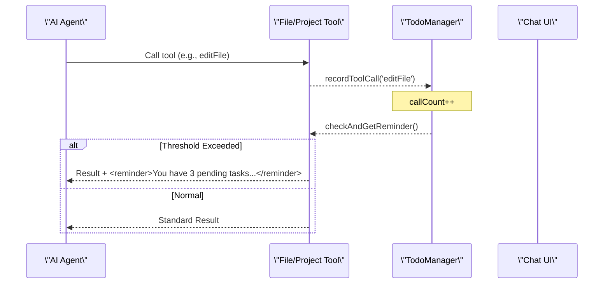

# AI Agent Tools

<details>
<summary>Relevant source files</summary>

The following files were used as context for generating this wiki page:

- [src/app/tools/aily-chat/components/aily-approval-viewer/aily-approval-viewer.component.html](src/app/tools/aily-chat/components/aily-approval-viewer/aily-approval-viewer.component.html)
- [src/app/tools/aily-chat/components/aily-approval-viewer/aily-approval-viewer.component.scss](src/app/tools/aily-chat/components/aily-approval-viewer/aily-approval-viewer.component.scss)
- [src/app/tools/aily-chat/components/aily-approval-viewer/aily-approval-viewer.component.ts](src/app/tools/aily-chat/components/aily-approval-viewer/aily-approval-viewer.component.ts)
- [src/app/tools/aily-chat/components/aily-task-action-viewer/aily-task-action-viewer.component.html](src/app/tools/aily-chat/components/aily-task-action-viewer/aily-task-action-viewer.component.html)
- [src/app/tools/aily-chat/components/aily-task-action-viewer/aily-task-action-viewer.component.scss](src/app/tools/aily-chat/components/aily-task-action-viewer/aily-task-action-viewer.component.scss)
- [src/app/tools/aily-chat/components/aily-task-action-viewer/aily-task-action-viewer.component.ts](src/app/tools/aily-chat/components/aily-task-action-viewer/aily-task-action-viewer.component.ts)
- [src/app/tools/aily-chat/components/floating-todo/floating-todo.component.html](src/app/tools/aily-chat/components/floating-todo/floating-todo.component.html)
- [src/app/tools/aily-chat/components/floating-todo/floating-todo.component.scss](src/app/tools/aily-chat/components/floating-todo/floating-todo.component.scss)
- [src/app/tools/aily-chat/components/floating-todo/floating-todo.component.ts](src/app/tools/aily-chat/components/floating-todo/floating-todo.component.ts)
- [src/app/tools/aily-chat/components/x-dialog/x-aily-approval-viewer/x-aily-approval-viewer.component.ts](src/app/tools/aily-chat/components/x-dialog/x-aily-approval-viewer/x-aily-approval-viewer.component.ts)
- [src/app/tools/aily-chat/components/x-dialog/x-aily-question-viewer/x-aily-question-viewer.component.ts](src/app/tools/aily-chat/components/x-dialog/x-aily-question-viewer/x-aily-question-viewer.component.ts)
- [src/app/tools/aily-chat/core/async-fs.ts](src/app/tools/aily-chat/core/async-fs.ts)
- [src/app/tools/aily-chat/core/chat-types.ts](src/app/tools/aily-chat/core/chat-types.ts)
- [src/app/tools/aily-chat/core/index.ts](src/app/tools/aily-chat/core/index.ts)
- [src/app/tools/aily-chat/core/tool-approval.ts](src/app/tools/aily-chat/core/tool-approval.ts)
- [src/app/tools/aily-chat/helpers/message-display.helper.ts](src/app/tools/aily-chat/helpers/message-display.helper.ts)
- [src/app/tools/aily-chat/helpers/npm-command-display.helper.ts](src/app/tools/aily-chat/helpers/npm-command-display.helper.ts)
- [src/app/tools/aily-chat/mcp/mcp.json](src/app/tools/aily-chat/mcp/mcp.json)
- [src/app/tools/aily-chat/services/audit-log.service.ts](src/app/tools/aily-chat/services/audit-log.service.ts)
- [src/app/tools/aily-chat/services/command-security.service.ts](src/app/tools/aily-chat/services/command-security.service.ts)
- [src/app/tools/aily-chat/services/content-sanitizer.service.ts](src/app/tools/aily-chat/services/content-sanitizer.service.ts)
- [src/app/tools/aily-chat/services/mcp.service.ts](src/app/tools/aily-chat/services/mcp.service.ts)
- [src/app/tools/aily-chat/services/security-context.service.ts](src/app/tools/aily-chat/services/security-context.service.ts)
- [src/app/tools/aily-chat/services/security.service.ts](src/app/tools/aily-chat/services/security.service.ts)
- [src/app/tools/aily-chat/services/todoContext.service.ts](src/app/tools/aily-chat/services/todoContext.service.ts)
- [src/app/tools/aily-chat/services/todoUpdate.service.ts](src/app/tools/aily-chat/services/todoUpdate.service.ts)
- [src/app/tools/aily-chat/tools/askUserTool.ts](src/app/tools/aily-chat/tools/askUserTool.ts)
- [src/app/tools/aily-chat/tools/checkExistsTool.ts](src/app/tools/aily-chat/tools/checkExistsTool.ts)
- [src/app/tools/aily-chat/tools/createFileTool.ts](src/app/tools/aily-chat/tools/createFileTool.ts)
- [src/app/tools/aily-chat/tools/createFolderTool.ts](src/app/tools/aily-chat/tools/createFolderTool.ts)
- [src/app/tools/aily-chat/tools/createProjectTool.ts](src/app/tools/aily-chat/tools/createProjectTool.ts)
- [src/app/tools/aily-chat/tools/deleteFileTool.ts](src/app/tools/aily-chat/tools/deleteFileTool.ts)
- [src/app/tools/aily-chat/tools/deleteFolderTool.ts](src/app/tools/aily-chat/tools/deleteFolderTool.ts)
- [src/app/tools/aily-chat/tools/editAbiFileTool.ts](src/app/tools/aily-chat/tools/editAbiFileTool.ts)
- [src/app/tools/aily-chat/tools/editFileTool.ts](src/app/tools/aily-chat/tools/editFileTool.ts)
- [src/app/tools/aily-chat/tools/executeCommandTool.ts](src/app/tools/aily-chat/tools/executeCommandTool.ts)
- [src/app/tools/aily-chat/tools/fetchTool.ts](src/app/tools/aily-chat/tools/fetchTool.ts)
- [src/app/tools/aily-chat/tools/fileOperationsTestSuite.ts](src/app/tools/aily-chat/tools/fileOperationsTestSuite.ts)
- [src/app/tools/aily-chat/tools/fileOperationsTool.ts](src/app/tools/aily-chat/tools/fileOperationsTool.ts)
- [src/app/tools/aily-chat/tools/getBoardParametersTool.ts](src/app/tools/aily-chat/tools/getBoardParametersTool.ts)
- [src/app/tools/aily-chat/tools/getContextTool.ts](src/app/tools/aily-chat/tools/getContextTool.ts)
- [src/app/tools/aily-chat/tools/getDirectoryTreeTool.ts](src/app/tools/aily-chat/tools/getDirectoryTreeTool.ts)
- [src/app/tools/aily-chat/tools/getHardwareCategoriesTools.ts](src/app/tools/aily-chat/tools/getHardwareCategoriesTools.ts)
- [src/app/tools/aily-chat/tools/globTool.ts](src/app/tools/aily-chat/tools/globTool.ts)
- [src/app/tools/aily-chat/tools/grepTool.ts](src/app/tools/aily-chat/tools/grepTool.ts)
- [src/app/tools/aily-chat/tools/index.ts](src/app/tools/aily-chat/tools/index.ts)
- [src/app/tools/aily-chat/tools/listDirectoryTool.ts](src/app/tools/aily-chat/tools/listDirectoryTool.ts)
- [src/app/tools/aily-chat/tools/readFileTool.ts](src/app/tools/aily-chat/tools/readFileTool.ts)
- [src/app/tools/aily-chat/tools/registered/file-tools.ts](src/app/tools/aily-chat/tools/registered/file-tools.ts)
- [src/app/tools/aily-chat/tools/reloadAbiJsonTool.ts](src/app/tools/aily-chat/tools/reloadAbiJsonTool.ts)
- [src/app/tools/aily-chat/tools/searchBoardsLibrariesTool.ts](src/app/tools/aily-chat/tools/searchBoardsLibrariesTool.ts)
- [src/app/tools/aily-chat/tools/todoWriteTool.ts](src/app/tools/aily-chat/tools/todoWriteTool.ts)
- [src/app/tools/aily-chat/tools/tools.ts](src/app/tools/aily-chat/tools/tools.ts)
- [src/app/tools/aily-chat/tools/webSearchTool.ts](src/app/tools/aily-chat/tools/webSearchTool.ts)
- [src/app/tools/aily-chat/utils/todoStorage.ts](src/app/tools/aily-chat/utils/todoStorage.ts)

</details>


The Aily Blockly AI Assistant utilizes a comprehensive suite of tools that allow the AI agent to interact with the file system, manage hardware projects, perform web searches, and maintain state via a todo system. To ensure safety, a robust security and approval layer intercepts sensitive operations.

## Tool Architecture and Loading

The system distinguishes between **Core Tools**, which are always available to the LLM, and **Deferred Tools**, which are loaded on-demand to conserve context budget [src/app/tools/aily-chat/tools/tools.ts:11-21]().

### Tool Discovery Data Flow
The `search_available_tools` meta-tool allows the LLM to query the `DEFERRED_TOOL_GROUPS` when it needs capabilities not present in its immediate context [src/app/tools/aily-chat/tools/tools.ts:109-110]().

| Group | Key Tools | Purpose |
| :--- | :--- | :--- |
| **File** | `create_folder`, `delete_file` | Basic filesystem manipulation |
| **Search** | `grep_tool`, `glob_tool` | Codebase exploration and pattern matching |
| **Network** | `fetch`, `web_search` | External documentation and API access |
| **Hardware** | `search_boards_libraries` | Hardware metadata and library discovery |
| **Project** | `create_project`, `switch_board` | Lifecycle and configuration management |
| **Terminal** | `start_background_command` | Long-running process execution |

**Sources:** [src/app/tools/aily-chat/tools/tools.ts:23-66](), [src/app/tools/aily-chat/tools/tools.ts:74-86]()

---

## Filesystem and Project Tools

### File Operations
The agent performs file I/O through a secured abstraction layer. `readFileTool` includes \"Smart Reading\" logic that automatically detects large files or single-line minified files, providing the agent with byte-range or line-range samples to prevent context overflow [src/app/tools/aily-chat/tools/readFileTool.ts:16-29]().

### Project Context
The `getContextTool` provides the agent with a snapshot of the current environment, including:
*   **Project Info:** Name, path, and installed libraries [src/app/tools/aily-chat/tools/getContextTool.ts:22-29]().
*   **Editing Mode:** Whether the user is in `blockly` or `code` mode [src/app/tools/aily-chat/tools/getContextTool.ts:47-49]().
*   **Workspace Overview:** A text-based representation of the Blockly workspace (ABS) and generated C++ code [src/app/tools/aily-chat/tools/getContextTool.ts:102-103]().

### Hardware Search
The `search_boards_libraries` tool queries `boards-index.json` and `libraries-index.json`. It supports structured filtering for hardware specs like Flash size, SRAM, and connectivity (WiFi/BLE) [src/app/tools/aily-chat/tools/searchBoardsLibrariesTool.ts:123-157]().

**Sources:** [src/app/tools/aily-chat/tools/readFileTool.ts:98-112](), [src/app/tools/aily-chat/tools/getContextTool.ts:66-112](), [src/app/tools/aily-chat/tools/searchBoardsLibrariesTool.ts:3-49]()

---

## Web and Network Tools

The `FetchToolService` enables the agent to retrieve external resources while protecting against binary bloat.

*   **URL Classification:** Blocks binary, media, and document extensions [src/app/tools/aily-chat/tools/fetchTool.ts:5-22]().
*   **GitHub Optimization:** If a GitHub repo URL is detected, it fetches the `README.md` and repository metadata instead of the raw HTML [src/app/tools/aily-chat/tools/fetchTool.ts:138-141]().
*   **Content Sanitization:** Converts HTML to clean Markdown to maximize token efficiency [src/app/tools/aily-chat/tools/fetchTool.ts:194-196]().

**Sources:** [src/app/tools/aily-chat/tools/fetchTool.ts:108-141](), [src/app/tools/aily-chat/tools/fetchTool.ts:185-196]()

---

## Todo and State Management

To maintain long-term goals during multi-turn conversations, the agent uses a **Todo Management System**.

*   **Todo Storage:** Persistent storage for tasks with status (`not-started`, `in-progress`, `completed`) and priority [src/app/tools/aily-chat/utils/todoStorage.ts]().
*   **Proactive Reminders:** The `TodoManager` tracks tool calls. If the agent performs multiple operations without updating the todo list, the system injects a `<reminder>` block into the next tool result to keep the agent focused on the user's objective [src/app/tools/aily-chat/tools/todoWriteTool.ts:73-109]().

### Interaction Logic: Todo Injection
Title: Todo Reminder Data Flow

**Sources:** [src/app/tools/aily-chat/tools/todoWriteTool.ts:17-31](), [src/app/tools/aily-chat/tools/todoWriteTool.ts:121-128]()

---

## Security and Approval System

All sensitive operations (command execution, file deletion, network requests) pass through a security validation and user approval pipeline.

### Command Validation
The `executeCommandTool` uses `CommandSecurity` to validate:
1.  **Risk Level:** Commands are categorized as `low`, `medium`, `high`, or `critical` [src/app/tools/aily-chat/tools/executeCommandTool.ts:48-54]().
2.  **Path Restriction:** Operations must occur within the current project path or allowed temporary directories [src/app/tools/aily-chat/tools/executeCommandTool.ts:72-73]().
3.  **Blocked Patterns:** Prevention of shell injection or dangerous system commands [src/app/tools/aily-chat/services/command-security.service.ts]().

### User Approval Flow
When a tool requires approval, the agent's execution is suspended, and an `XAilyApprovalViewerComponent` is rendered in the chat.

Title: Security Interception to UI
```mermaid
graph TD
    subgraph \"Code Entity Space\"
        ECT[\"executeCommandTool (executeCommandTool.ts)\"]
        VS[\"validateCommand (command-security.service.ts)\"]
        AL[\"logCommandExecution (audit-log.service.ts)\"]
        AVC[\"XAilyApprovalViewerComponent (x-aily-approval-viewer.component.ts)\"]
    end

    Agent[\"Natural Language Space: AI Agent\"] -->|Requests Command| ECT
    ECT --> VS
    VS -->|High Risk| AL
    AL -->|Trigger UI| AVC
    AVC -->|User Action: onApprove()| ECT
    ECT -->|Authorized| CMD[\"System Shell\"]
```

**Sources:** [src/app/tools/aily-chat/tools/executeCommandTool.ts:18-70](), [src/app/tools/aily-chat/components/x-dialog/x-aily-approval-viewer/x-aily-approval-viewer.component.ts:181-190]()

---

## MCP (Model Context Protocol) Integration

The `McpService` allows the AI agent to connect to external MCP servers, extending its capabilities beyond the built-in toolset.

*   **Initialization:** Loads server configurations from `mcp.json` [src/app/tools/aily-chat/services/mcp.service.ts:74-104]().
*   **Dynamic Tool Mapping:** Discovers tools from connected servers and registers them into the agent's tool registry [src/app/tools/aily-chat/services/mcp.service.ts:55-64]().
*   **Stdio Transport:** Communicates with MCP servers via standard I/O pipes managed by the Electron main process [src/app/tools/aily-chat/services/mcp.service.ts:147-153]().

**Sources:** [src/app/tools/aily-chat/services/mcp.service.ts:25-71](), [src/app/tools/aily-chat/services/mcp.service.ts:211-244]()
