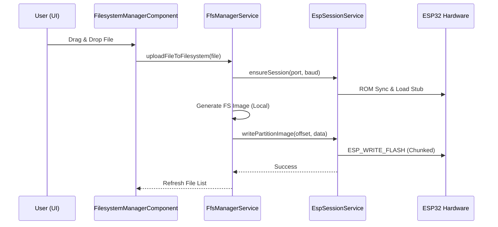

# Flash File System Manager

<details>
<summary>Relevant source files</summary>

The following files were used as context for generating this wiki page:

- [electron/serial.js](electron/serial.js)
- [src/app/tools/ffs-manager/baudrate-strategy.md](src/app/tools/ffs-manager/baudrate-strategy.md)
- [src/app/tools/ffs-manager/components/device-info/device-info.component.scss](src/app/tools/ffs-manager/components/device-info/device-info.component.scss)
- [src/app/tools/ffs-manager/components/file-image-viewer/file-image-viewer.component.html](src/app/tools/ffs-manager/components/file-image-viewer/file-image-viewer.component.html)
- [src/app/tools/ffs-manager/components/file-image-viewer/file-image-viewer.component.scss](src/app/tools/ffs-manager/components/file-image-viewer/file-image-viewer.component.scss)
- [src/app/tools/ffs-manager/components/file-image-viewer/file-image-viewer.component.ts](src/app/tools/ffs-manager/components/file-image-viewer/file-image-viewer.component.ts)
- [src/app/tools/ffs-manager/components/file-text-viewer/file-text-viewer.component.html](src/app/tools/ffs-manager/components/file-text-viewer/file-text-viewer.component.html)
- [src/app/tools/ffs-manager/components/file-text-viewer/file-text-viewer.component.scss](src/app/tools/ffs-manager/components/file-text-viewer/file-text-viewer.component.scss)
- [src/app/tools/ffs-manager/components/file-text-viewer/file-text-viewer.component.ts](src/app/tools/ffs-manager/components/file-text-viewer/file-text-viewer.component.ts)
- [src/app/tools/ffs-manager/components/filesystem-manager/filesystem-manager.component.html](src/app/tools/ffs-manager/components/filesystem-manager/filesystem-manager.component.html)
- [src/app/tools/ffs-manager/components/filesystem-manager/filesystem-manager.component.scss](src/app/tools/ffs-manager/components/filesystem-manager/filesystem-manager.component.scss)
- [src/app/tools/ffs-manager/components/filesystem-manager/filesystem-manager.component.ts](src/app/tools/ffs-manager/components/filesystem-manager/filesystem-manager.component.ts)
- [src/app/tools/ffs-manager/components/partition-map/partition-map.component.html](src/app/tools/ffs-manager/components/partition-map/partition-map.component.html)
- [src/app/tools/ffs-manager/components/partition-map/partition-map.component.scss](src/app/tools/ffs-manager/components/partition-map/partition-map.component.scss)
- [src/app/tools/ffs-manager/components/partition-map/partition-map.component.ts](src/app/tools/ffs-manager/components/partition-map/partition-map.component.ts)
- [src/app/tools/ffs-manager/esp-session.service.ts](src/app/tools/ffs-manager/esp-session.service.ts)
- [src/app/tools/ffs-manager/ffs-filesystem-content.service.ts](src/app/tools/ffs-manager/ffs-filesystem-content.service.ts)
- [src/app/tools/ffs-manager/ffs-manager.component.html](src/app/tools/ffs-manager/ffs-manager.component.html)
- [src/app/tools/ffs-manager/ffs-manager.component.ts](src/app/tools/ffs-manager/ffs-manager.component.ts)
- [src/app/tools/ffs-manager/ffs-manager.service.ts](src/app/tools/ffs-manager/ffs-manager.service.ts)
- [src/app/tools/ffs-manager/node-serial-port.ts](src/app/tools/ffs-manager/node-serial-port.ts)
- [src/app/tools/ffs-manager/usb-bridge.ts](src/app/tools/ffs-manager/usb-bridge.ts)

</details>


The Flash File System (FFS) Manager is a specialized development tool within the Aily Blockly IDE designed for managing the storage partitions of embedded devices (primarily ESP32 series). It provides a high-level interface for visualizing partition maps, browsing filesystem contents, and performing file operations such as upload, download, and formatting via serial communication [src/app/tools/ffs-manager/ffs-manager.component.ts:21-24]().

## System Architecture

The FFS Manager operates across three layers: the Angular UI, the ESP Session management layer, and a Node.js SerialPort adapter that bridges Electron to the hardware [src/app/tools/ffs-manager/node-serial-port.ts:1-8]().

### Data Flow and Entity Mapping

The following diagram illustrates how the natural language requirements map to specific code entities and the flow of data from the UI to the physical device.

**FFS Manager Entity Mapping**
```mermaid
graph TD
    subgraph \"UI Layer (Angular)\"
        A[\"Filesystem Explorer UI\"] -->|EventEmitter| B[\"FfsManagerComponent\"]
        B -->|Input/Output| C[\"FilesystemManagerComponent\"]
        B -->|Input| D[\"PartitionMapComponent\"]
    end

    subgraph \"Service Layer\"
        B --> E[\"FfsManagerService\"]
        E --> F[\"EspSessionService\"]
        F --> G[\"FfsFilesystemContentService\"]
    end

    subgraph \"Hardware Bridge (Electron/Node)\"
        F --> H[\"NodeSerialPortAdapter\"]
        H --> I[\"electronAPI.SerialPort.createRaw\"]
        I --> J[\"SerialPort (Node Module)\"]
    end

    J <-->|Serial Data| K[\"ESP32 Flash Memory\"]
```
Sources: [src/app/tools/ffs-manager/ffs-manager.component.ts:87-98](), [src/app/tools/ffs-manager/esp-session.service.ts:32-40](), [src/app/tools/ffs-manager/node-serial-port.ts:30-43]()

## ESP Session Management

Communication with the device is managed by the `EspSessionService`. This service wraps `esptool-js` to handle the low-level ROM synchronization and stub execution required for flash operations [src/app/tools/ffs-manager/esp-session.service.ts:66-95]().

### Connection Lifecycle
1.  **Handshake**: The service performs a ROM sync at 115200 baud, detects the chip, and uploads a software stub to the device's RAM [src/app/tools/ffs-manager/esp-session.service.ts:93-95]().
2.  **Baud Rate Capping**: It uses `resolveDesiredBaud` to check the USB-to-Serial bridge chip (e.g., CH340, CP2102). If the requested baud rate exceeds the bridge's physical limit, it automatically caps the rate and notifies the UI [src/app/tools/ffs-manager/esp-session.service.ts:79-82]().
3.  **Exclusive Access**: All flash operations are wrapped in `runExclusive` to prevent command collisions [src/app/tools/ffs-manager/esp-session.service.ts:178-180]().

### Node SerialPort Adapter
Because `esptool-js` expects a Web Serial API interface, the `NodeSerialPortAdapter` implements a compatibility layer. It maps Node.js `SerialPort` methods to `ReadableStream` and `WritableStream` [src/app/tools/ffs-manager/node-serial-port.ts:61-73](). It also includes a \"Parking\" mechanism where the OS handle is kept open for 800ms during baud rate changes to avoid `ACCESS_DENIED` errors on Windows [src/app/tools/ffs-manager/node-serial-port.ts:50-53]().

Sources: [src/app/tools/ffs-manager/esp-session.service.ts:1-205](), [src/app/tools/ffs-manager/node-serial-port.ts:1-154](), [electron/serial.js:13-48]()

## Partition Visualization

The `PartitionMapComponent` renders a visual representation of the device's flash layout [src/app/tools/ffs-manager/components/partition-map/partition-map.component.ts:15-16]().

| Feature | Implementation |
| :--- | :--- |
| **Detection** | Probes standard offsets (0x8000, 0x9000, etc.) for the ESP partition table magic `0x50aa` [src/app/tools/ffs-manager/ffs-manager.service.ts:36-43](). |
| **Classification** | Categorizes segments into `spiffs`, `littlefs`, `fatfs`, `app`, `nvs`, etc., based on type and subtype IDs [src/app/tools/ffs-manager/components/partition-map/partition-map.component.ts:42-53](). |
| **Rendering** | Uses CSS flexbox with percentage widths calculated from `partition.size / totalSize` [src/app/tools/ffs-manager/components/partition-map/partition-map.component.ts:36-40](). |

Sources: [src/app/tools/ffs-manager/ffs-manager.service.ts:165-203](), [src/app/tools/ffs-manager/components/partition-map/partition-map.component.ts:32-53]()

## Filesystem Management

The `FilesystemManagerComponent` provides a file-explorer interface for partitions identified as containing a supported filesystem (LittleFS, SPIFFS, or FATFS) [src/app/tools/ffs-manager/components/filesystem-manager/filesystem-manager.component.ts:30-49]().

### Implementation Details
-   **Navigation**: Maintains a `currentPath` and calculates `displayEntries` by filtering the flat file list provided by `FfsFilesystemContentService` [src/app/tools/ffs-manager/components/filesystem-manager/filesystem-manager.component.ts:113-182]().
-   **File Operations**: Supports drag-and-drop uploads, renaming, and deletion. Deletions for directories are recursive if supported by the filesystem type [src/app/tools/ffs-manager/components/filesystem-manager/filesystem-manager.component.html:100-113]().
-   **Write-Back Mechanism**: Filesystem changes are often staged. The \"Write Back\" action triggers a full image generation and flash write to the specific partition offset [src/app/tools/ffs-manager/components/filesystem-manager/filesystem-manager.component.html:67-73]().

### Interaction Sequence
The diagram below shows the sequence for uploading a file to the device's filesystem.

**File Upload Sequence**

Sources: [src/app/tools/ffs-manager/components/filesystem-manager/filesystem-manager.component.ts:100-113](), [src/app/tools/ffs-manager/ffs-manager.service.ts:145-157](), [src/app/tools/ffs-manager/esp-session.service.ts:228-245]()

## Serial Resource Coordination

A critical feature of the FFS Manager is its ability to coexist with the Serial Monitor. Since hardware serial ports are exclusive, the FFS Manager listens to `uiService.actionSubject` for `serial-monitor:disconnect` signals [src/app/tools/ffs-manager/ffs-manager.component.ts:130-153]().

-   **Pause for Upload**: When a firmware upload starts, the FFS Manager receives a signal, releases its serial session, and provides a `waitFor` promise to the uploader to ensure the port is free [src/app/tools/ffs-manager/ffs-manager.component.ts:142-148]().
-   **Automatic Restore**: After the uploader finishes, the FFS Manager schedules a restoration of its connection after a 200ms delay to allow the serial driver to stabilize [src/app/tools/ffs-manager/ffs-manager.component.ts:149-151]().

Sources: [src/app/tools/ffs-manager/ffs-manager.component.ts:54-56](), [src/app/tools/ffs-manager/ffs-manager.component.ts:130-153](), [electron/serial.js:35-48]()
